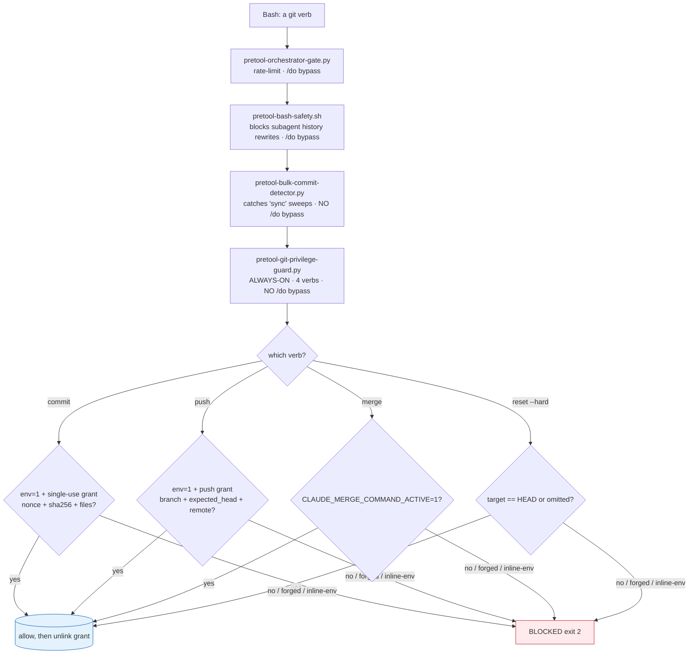
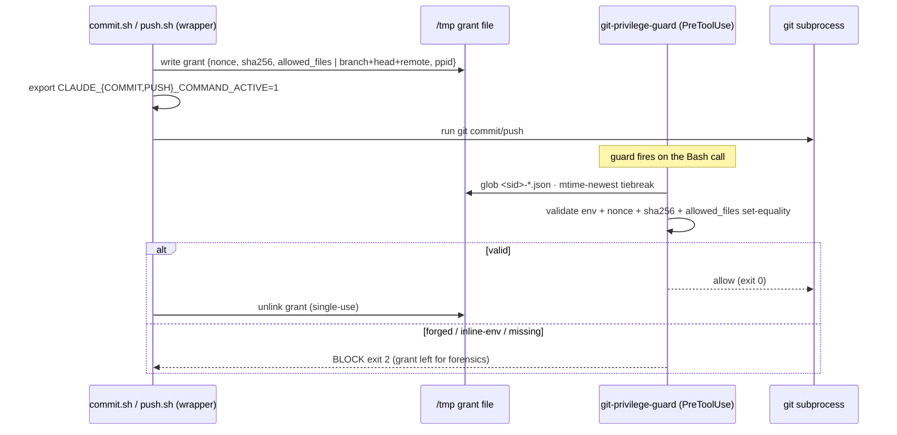
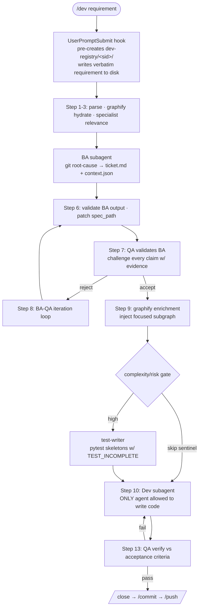
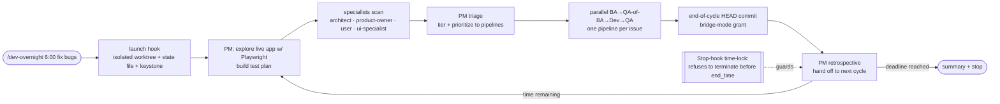

# Architecture — `.claude` Agent Operating System

> Deep technical architecture and design rationale for maintainers.
> Last updated: 2026-06-13

This repository is a **Claude Code global configuration** (`~/.claude` symlinks to it) that turns one chat agent into a disciplined software team. A main *orchestrator* agent is mechanically prevented from touching code and instead dispatches single-purpose **subagents**; a defense-in-depth chain of **PreToolUse / PostToolUse / Stop** hooks makes catastrophic git and filesystem mistakes structurally impossible; and an autonomous overnight loop explores, fixes, verifies, and commits in an isolated worktree until a wall-clock deadline. Everything here is plain Markdown prompts plus small Python/Bash hooks and scripts — the behavior change comes from *enforcement in code*, not from asking the model nicely.

This document is the maintainer-facing companion to [`README.md`](README.md): the README is the value-prop overview, this file goes deeper into mechanisms, data flows, lifecycles, and the *why* behind the design. The two share the same verified component counts and terminology.

---

## 1. Verified inventory (2026-06-13)

All counts below were established by enumerating the actual repository, not copied from prose. Reproduction commands are noted so a maintainer can re-verify after changes.

| Component | Count | How counted |
|---|---|---|
| **Subagents** (`agents/*.md`, excluding `INDEX.md`/`README.md`) | **23** | `ls agents/*.md \| grep -vE '/(INDEX\|README)\.md$'` |
| **Slash commands** (`commands/*.md`, excluding `INDEX.md`/`README.md`) | **35** | `ls commands/*.md \| grep -vE '/(INDEX\|README)\.md$'` |
| **Hook command entries wired** in `settings.json` | **69** | sum of `hooks[*][*].hooks[]` over all lifecycle events |
| **Distinct hook files referenced** by `settings.json` | **68** | unique `hooks/*.py\|*.sh` paths in those entries |
| **Lifecycle events used** | **7** | keys of `settings.json.hooks` |
| **Hook files present on disk** (`hooks/*.py` + `*.sh`, excl. `.bak`) | **92** | `find hooks -maxdepth 1 -type f \( -name '*.py' -o -name '*.sh' \)` |
| **Helper scripts** (`scripts/` top-level files, excl. `INDEX/README`) | **72** | `find scripts -maxdepth 1 -type f` minus docs |
| **Skills** (`skills/*/` directories) | **12** | `ls -d skills/*/` |
| `permissions.allow` / `deny` / `ask` entries | 175 / 75 / 30 | keys of `settings.json.permissions` |

> Note on the hook count: more hook *files* exist on disk (92) than are *wired* (68). The unwired files are install scripts, libraries, legacy/`.bak` variants, and intentionally-staged hooks. The number that matters for behavior is **what `settings.json` wires**: 68 distinct files across 69 entries (a few hooks run under more than one matcher). The seven lifecycle events are `SessionStart`, `UserPromptSubmit`, `PreToolUse`, `PostToolUse`, `Notification`, `Stop`, `SubagentStop`.

### Per-event wiring (from `settings.json`)

| Event | Matcher blocks | Hook entries |
|---|---|---|
| `SessionStart` | 1 | 7 |
| `UserPromptSubmit` | 5 | 6 |
| `PreToolUse` | 23 | 31 |
| `PostToolUse` | 7 | 14 |
| `Notification` | 1 | 1 |
| `Stop` | 1 | 4 |
| `SubagentStop` | 4 | 6 |

---

## 2. Design stance

Five principles run through every file. They are the architecture's load-bearing assumptions; the rest of the system is their consequence.

1. **Orchestrator-only.** The main agent *thinks and routes*; it never writes code or runs privileged git. This is enforced by `hooks/pretool-orchestrator-gate.py`, not by prompt etiquette.
2. **Enforce in code, not in prose.** "Please don't force-push" is a wish; a `PreToolUse` hook returning exit 2 is a guarantee. Wherever a rule *can* be a hook, it *is* a hook.
3. **Fail closed, leave forensics.** Ambiguous grant → reject. Unparseable QA verdict → treat as failure. On rejection the evidence (grant file, raw output) is left on disk so a human can see exactly what happened.
4. **Rules, not stories.** Agent/command prompts state what is *required* and what is *forbidden*, tersely. Every infrastructure-touching subagent prompt carries an explicit **DO NOT** section — positive instructions alone proved insufficient (see `docs/reference/incidents-2026-04-04.md`).
5. **One subagent, one task.** N issues → N parallel subagents, each with a clean context. Multitasking inside one subagent is banned (`CLAUDE.md` lesson #13).

---

## 3. Component architecture (the layers)

```mermaid
flowchart TD
    U([User requirement]) --> ORCH

    subgraph L0[Main agent — ORCHESTRATOR ONLY]
      ORCH{{think + route}}
    end

    subgraph L1[Command surface · commands/*.md]
      CMD[/dev /close /commit /push /dev-overnight .../]
    end

    subgraph L2[Subagent fleet · agents/*.md]
      FLEET[ba · dev · qa · architect · pm · ...]
    end

    subgraph L3[Hook enforcement · settings.json + hooks/]
      HOOKS[[PreToolUse · PostToolUse · Stop · SubagentStop · ...]]
    end

    subgraph L4[Support]
      SCR[scripts/ — grant writers, graphify, resolvers]
      SK[skills/ — docx/pdf/pptx/xlsx + UI audit]
      SCH[schemas/ + templates/]
    end

    ORCH --> CMD
    ORCH ==>|Agent: WHAT not HOW| FLEET
    FLEET --> SCR
    FLEET --> SK
    L0 -.every tool call passes through.-> L3
    L2 -.every tool call passes through.-> L3
    L3 -.validates against.-> SCH
```



- **Orchestrator (main agent).** Owns the conversation, the todo list, and dispatch. Allowed tools are a small whitelist (`Agent`, `TodoWrite`, `AskUserQuestion`, `Skill`, `Read`, `Glob`, `Grep`, `Bash`, cron/title tools); everything else is rate-limited or blocked by the orchestrator gate. (`CLAUDE.md` §Orchestrator-Only Rule.)
- **Command surface (`commands/*.md`).** 35 slash commands. Each is a prompt that scripts a workflow (parse → dispatch → validate → ship). Release/control commands carry `disable-model-invocation: true` so an agent cannot self-invoke them.
- **Subagent fleet (`agents/*.md`).** 23 specialists, each a system prompt with `name`/`description`/`tools` frontmatter. Subagents bypass the orchestrator gate (they are *supposed* to do work) but are still subject to the safety, git, and worktree hooks.
- **Hook enforcement (`settings.json` + `hooks/`).** The kernel. Every tool call the agent makes is intercepted; hooks return exit 2 to block. Shared logic lives in `hooks/lib/` (allowlist/sentinel grants, checkpoint core, contract runtime, agent resolver).
- **Support.** `scripts/` (72 helpers: grant writers, graphify code-graph, spec/dev-report resolvers), `skills/` (12: Office + Playwright UI-audit suite), `schemas/` (JSON contracts like `context.v1.json`, `cycle-contract.v1.json`, `dev-report.v1.json`, `qa-report.v1.json`), `templates/` (`spec-template.md`, `overnight-spec.md`).

### The 23 subagents (by role)

- **Development pipeline** — `ba` (requirements analyst, git root-cause → ticket + context), `dev` (the *only* agent permitted to write code files), `qa` (validates BA pre-code and Dev post-code against acceptance criteria), `test-writer` (pytest skeletons with `TEST_INCOMPLETE` hard-stops), `graphify` (incremental code-graph enrichment into the Dev context).
- **Exploration specialists** (overnight + on-demand) — `architect` (structural/tech-debt/dependency issues), `product-owner` (feature completeness, business-logic bugs), `user` (end-user simulation, UX friction), `ui-specialist` (visual quality + Playwright audit, 1–10 beauty score), `pm` (test-plan manager with PLAN / TRIAGE / RETRO modes).
- **Git & release analysts** — `changelog-analyst` (classify/stage/commit + push-gate tokens), `push-analyst`, `merge-analyst`, `pull-analyst` (pre-push / pre-merge / post-pull risk analysis with nonce-keyed grants).
- **Cleanup, audit & spec** — `cleaner`, `cleanliness-inspector`, `style-inspector`, `rule-inspector` (the `/clean` cohort); `spec` (split a monolithic spec into per-agent views + checkpoints); `prompt-inspector` (prompt verbosity); `git-edge-case-analyst`; `test-executor`, `test-validator` (test infra execution/validation).

---

## 4. The orchestration model — delegating WHAT, never HOW

The main agent's purity is enforced at two points:

**The orchestrator gate** (`hooks/pretool-orchestrator-gate.py`, `PreToolUse` matcher `*`):
- **Whitelisted tools** are always allowed; `Bash` is additionally capped at 5 *consecutive* same-name calls (the 6th blocks).
- **Non-whitelist tools** (`Edit`, `Write`, `WebFetch`, `NotebookEdit`, `EnterWorktree`, `mcp__playwright__*`, …) are allowed **once total per tool name per turn** — `NON_WHITELIST_MAX_CONSECUTIVE = 1`; the 2nd same-name call blocks regardless of intervening different calls.
- **Permanently blocked**: `EnterPlanMode`, `ExitPlanMode` — even under `/do`.
- **State** lives at `/tmp/claude-tool-streak-<sid>.json` (`schema_version: 2`, per-tool counts + a Bash-consecutive counter).
- **Bypass**: a `/do` consent flag set this session makes the gate exit 0 for everything except permanently-blocked tools — and crucially `/do` does **not** mutate the streak state, preserving clean semantics.
- **Subagents bypass** the gate entirely (they are detected by the presence of an `agent_id`).

**Prompt purity** (`hooks/pretool-orchestrator-prompt-purity.py`, `PreToolUse` matcher `Agent`): when the orchestrator dispatches a subagent, the dispatch prompt must describe the *problem, constraints, and acceptance criteria* — never tool names or shell syntax. This keeps the specialist free to pick its own toolchain and keeps the orchestrator out of the work. The `Agent` matcher also chains six other pre-dispatch checks (concurrency, layer-escalation, bisect-gate, foreground-agent block, aggregate-check, gitignore-preflight).

The net effect: a one-line fix can be done directly via `/do`, but by default *every byte of code is written by a fresh `dev` subagent in its own context*.

---

## 5. The hook execution model

Hooks are configured in `settings.json` under `hooks.<Event>[].{matcher, hooks[]}`. Claude Code runs each matching hook *before* (`PreToolUse`) or *after* (`PostToolUse`) the tool call, on conversation end (`Stop`), on subagent end (`SubagentStop`), at session start, on each user prompt, and on idle notifications.

- **Matchers** are tool-name globs: `*` (all tools), a single name (`Bash`, `Read`, `TodoWrite`, `Agent`, `EnterWorktree`, `Skill`), an alternation (`Write|Edit|MultiEdit`), or a Bash-command regex (`Bash\(git commit.*\)`).
- **Exit code contract**: exit `0` = allow; exit `2` = **block** the tool call and surface stderr to the agent. Hooks read the pending tool call as JSON on stdin.
- **Ordering**: within one event, matcher blocks run in `settings.json` order, and within a block the listed hooks run in order. A `PreToolUse` chain stops at the first hook that exits 2.
- **State**: ephemeral state lives under `/tmp` (streak files `/tmp/claude-tool-streak-<sid>.json`, git grants `/tmp/claude-{commit,push}-grant-<sid>-<nonce>.json`, sentinel grants `/tmp/claude-grants/<task_id>.json`). Durable workflow state lives under `.claude/` (`overnight-state-*.json`, `dev-registry/`, `docs/dev/`).
- **Shared libs** (`hooks/lib/`): `allowlist.py` (sentinel-grant structural matching), `checkpoint-core.sh` (git-plumbing snapshots), `contract_runtime.py` / `schema_registry.py` (cycle contracts), `closeout.py` (overnight cycle closeout), `agent_resolver.py`, `subagent.py`, `overnight.py`.

### Representative wiring

- **`SessionStart`** — environment announce + git init + tmpfs banner + gitignore propagation + a canary self-check (`session-info.sh`, `session-git-init.sh`, `check-todo-md-sync.py`, `session-promote-hook.sh`, `scripts/canary-verify.sh`, `session-tmpfs-banner.sh`, `session-gitignore-propagate.sh`).
- **`UserPromptSubmit`** — `prompt-workflow.py` (workflow detection + dev-registry pre-creation), `userprompt-doc-sync-check.py`, `prehook-overnight-worktree-check.sh` (overnight launch hook that creates the isolated worktree + state file), `userprompt-consent-allowlist.sh` (`/do`/`/allow` consent capture), tmpfs-pressure and bulk-commit-capability advisories.
- **`PreToolUse`** — the safety + git + worktree + subagent-discipline gates (detailed in §6 and §7). Note: although `pretool-layer-match-gate.sh` is named with a `pretool-` prefix, it is actually wired under `SubagentStop`.
- **`PostToolUse`** — `posttool-allowlist-consume.py` (single-use grant consumption), the todo trackers, `posttool-git-checkpoint.sh` + `posttool-doc-sync.py` + `posttool-command-frontmatter-validate.py` (on `Write|Edit|…`), and the overnight loop/trace hooks (on `Agent`).
- **`Stop`** — `stop-overnight-timelock.py` (refuses to end an overnight session before its deadline), `stop-spec-coverage-enforce.py`, `auto-commit.sh`, `stop-cleanup-allowlist.sh` (reap expired sentinels).
- **`SubagentStop`** — diff-check, guard-integrity, layer-match-gate, and the codex / e2e / cp enforcement hooks. (`subagentstop-cp-enforce.py` *is* wired here.)

---

## 6. The git protection kernel

The single most safety-critical subsystem. Authoritative design doc with 13 scenarios and 7 invariants: **`/root/docs/git-protection-architecture.md`**.

### 6.1 The layered PreToolUse chain (Bash → git verb)



Four hooks form a defense-in-depth chain (top to bottom). Crucially, the inner two **ignore `/do`**:

| Hook | Purpose | `/do` bypass? |
|---|---|---|
| `pretool-orchestrator-gate.py` | same-tool consecutive rate-limit | yes |
| `pretool-bash-safety.sh` | subagent history-mutation block (commit/merge/push/cherry-pick/rebase/revert) | yes |
| `pretool-bulk-commit-detector.py` | cross-session sweep detector (`chore(claude): sync` + ≥3 subsystem prefixes) | **no** |
| `pretool-git-privilege-guard.py` | always-on 4-verb gate + grant-manifest validation | **no** |

### 6.2 The grant-token lifecycle (write → validate → single-use consume)

A `commit` or `push` is only allowed if a **single-use grant manifest** authorizes that *exact* action:

```
/tmp/claude-{commit,push}-grant-<sid>-<nonce>.json
```



- **Per-nonce filename** gives race protection; the guard glob-finds via `<sid>-*.json` with an mtime-newest tiebreak.
- **`/commit` has two modes**: *closed-task mode* (`/commit <task-id>`) requires a `close-report-<id>.md` ending `CLOSE: YES` (PRIMARY) or a three-binding fallback over `completion`/`qa-report`/`dev-report` (SECONDARY); *bridge mode* (`/commit --auto-bulk-bridge <branch>`) is used by `/dev-overnight` per-cycle and stages the pre-staged set, emitting an `auto-bulk: end-of-cycle commit for <branch>` message that matches `BLESSED_BRIDGE_RE`.
- **`/push`** consults no closure evidence — it only requires a clean tree, an ahead-of-upstream branch, and a push grant (`branch` + `expected_head` + `remote`).
- **`/merge`** uses a pure env-var bypass (`CLAUDE_MERGE_COMMAND_ACTIVE=1`), no grant file.
- **Single-use**: the wrapper unlinks the grant on success (the canonical unlink, because `PreToolUse` does not fire on the wrapper's own subprocess); failures leave the grant for forensics and nonce-bound retry.

### 6.3 The break-glass model (`/do` and `/allow`)

Two narrow, human-authorized escape hatches:

- **`/do`** sets a session consent flag that makes the orchestrator gate and `bash-safety` exit 0 for one turn. It does **not** bypass the git privilege guard or the bulk-commit detector (invariant #6).
- **`/allow`** writes a **structured sentinel grant** at `/tmp/claude-grants/<task_id>.json` = `{task_id, session_id, allowed_operations[], created_at, expires_at}`, where `allowed_operations[]` is a list of `{op, target?, args_contain?}` dicts. The hook matches *structurally* on the bash sub-command's first word (`op`), optional second word (`target`), and `args_contain[]` fragments via `hooks/lib/allowlist.py::match_sentinel_grant_for_bash_command()`. **Substring grep against the raw command line is forbidden** — the structured grant is the only declaration channel. The sentinel is consumed (`hooks/posttool-allowlist-consume.py`) on *any* terminal result and reaped at session end (`hooks/stop-cleanup-allowlist.sh`).

### 6.4 Branch / PR / worktree firewall

Creating a branch, PR, or worktree is forbidden by default everywhere (`CLAUDE.md` §No branch/PR/worktree). `hooks/pretool-block-branch-pr-worktree.py` (matcher `Bash`) blocks `git branch <name>`, `checkout -b`, `switch -c` (plus `--orphan`/copy/path-qualified/clustered-short-option forms), `git worktree add`, and `gh pr create`. `hooks/pretool-block-enterworktree.sh` blocks the `EnterWorktree` tool. List/delete/rename/info forms stay allowed. Bypass: a live `/dev-overnight` session, `/do`, or `/allow`.

### 6.5 Checkpoints (`refs/checkpoints/*`)

A loss-prevention mechanism that is *distinct* from HEAD commits. `hooks/posttool-git-checkpoint.sh` (matcher `Write|Edit|NotebookEdit|MultiEdit`) counts accumulated changes and, at threshold (`GIT_CHECKPOINT_THRESHOLD`, default **10** files), calls `hooks/lib/checkpoint-core.sh::write_checkpoint`. The lib uses pure git plumbing — `commit-tree` + `update-ref` (CAS, retried on race) — to write a snapshot to `refs/checkpoints/<sanitized-branch>` (detached-HEAD fallback `refs/checkpoints/detached-<sha>`). **It never moves `HEAD` or any branch ref**, so it bypasses the privilege guard by design. Recovery: `git checkout refs/checkpoints/<branch> -- <path>`. Full ops: `docs/reference/checkpoint-mechanism.md`.

### 6.6 Git-native keystone

`hooks/git-keystone/reference-transaction` is a git-native ref hook wired via `core.hooksPath` relocation (`scripts/install-git-keystone.sh`). Git invokes it for *every* ref update on *all* launch paths (PATH git, `/usr/bin/git`, python subprocess), so it catches ref moves that a Bash-level hook would miss. Its DENY policy is **actor-scoped**: it only acts when `CLAUDE_OVERNIGHT_ACTOR=1` and no blessed token is present; a normal session is unaffected (exit 0). This is the keystone that protects main HEAD/master during overnight runs.

---

## 7. The development pipeline (`/dev`)

`/dev <requirement>` runs an evidence-gated BA → QA-of-BA → Dev → QA pipeline. The orchestrator parses and *delegates* — it does not investigate.



- **Verbatim-requirement contract.** The launch hook writes the literal requirement to `docs/dev/user-requirement-<DEV_SESSION_ID>.md` (`commands/dev.md` Step 1). Every downstream dispatch prompt must quote the user's *literal* words — paraphrase is drift. When a spec exists, Section 5 (User's Acceptance Criterion) is quoted verbatim into every prompt.
- **dev-registry.** `dev-registry/<session>/` holds per-agent sentinel files, the graphify pre-query, and per-task artifacts; it is the coordination filesystem for one `/dev` run.
- **Evidence gate (QA-of-BA).** Before any code is written, QA challenges the BA's conclusions — git-blame evidence, file existence, scope-narrowing. A failed BA loops back (Step 8), catching a wasted Dev+QA cycle early.
- **Generated acceptance tests.** When `complexity_tier >= STANDARD` or `risk_level = high` (and BA did not set `_test_writer_skip_reason`), `agents/test-writer.md` emits pytest skeletons under `tests/generated/<task_id>/` with `pytest.fail("TEST_INCOMPLETE:…")` hard-stops that Dev must satisfy; the active manifest is `tests/generated/manifest.json`.
- **Dev exclusivity.** `hooks/pretool-subagent-code-block.py` and the production-file blocks ensure the `dev` subagent is effectively the only writer of code files.
- **Four Contracts.** The BA enforces four domain-agnostic cycle contracts (see `agents/ba.md` and `schemas/cycle-contract.v1.json`); the orchestrator surfaces pre-BA retry signals and verifies post-BA contract compliance.
- **Artifacts** land in `docs/dev/`: `ticket-<id>.md`, `context-<id>.json`, `ba-qa-report-<id>.json`, `acceptance-criteria-<id>.json`, `dev-report-<id>.json`, `qa-report-<id>.json`, `completion-<id>.md`, then `close-report-<id>.md`.

---

## 8. The overnight autonomous pipeline (`/dev-overnight`)

`/dev-overnight <end-time> <focus>` runs a todo-completion-driven loop in a dedicated worktree until a wall-clock deadline.



- **Launch** (`hooks/prehook-overnight-worktree-check.sh`, `UserPromptSubmit`): fails closed if it cannot produce a *validated isolated worktree*; on success it writes `.claude/overnight-state-<session_id>.json` with `worktree_path`, `worktree_branch`, `view_paths`, `spec_mode`, `actor_git_env`, etc. A missing/invalid state is a **HARD ABORT** for the actor.
- **Loop continuation** (`hooks/posttool-overnight-loop.py`, `PostToolUse` matcher `TodoWrite`): when all todos are completed, the session matches, and `end_time` is still in the future, it increments `cycle_count` and *prints* continuation instructions (it never edits the todos file directly, avoiding races).
- **Time-lock** (`hooks/stop-overnight-timelock.py`, `Stop`): scans for `overnight-state-*.json`; if `now < end_time` it exits 2 to **block termination**, so the loop cannot be short-circuited. Cancel explicitly with `/stop`.
- **Per-cycle commits** are real merge-ready HEAD commits via `commit.sh` bridge mode; mid-cycle `refs/checkpoints/*` snapshots are recovery-only and never advance HEAD (the two are explicitly distinct semantic layers).
- **Actor isolation**: the actor sources `actor_git_env`, which prepends a policy-shim git wrapper to `PATH` and sets `CLAUDE_OVERNIGHT_ACTOR=1`; defense-in-depth on top of the PreTool hook-guard and the git-native keystone.

> **Documented residual limitation — do not overstate isolation.** The overnight session runs in a *linked* git worktree that **shares the repository `.git` common-dir** with the main checkout (`commands/dev-overnight.md`, KNOWN ACCEPTED LIMITATION 2026-06-12). The current locks (the git reference-transaction keystone for HEAD/master moves; a per-Bash bwrap RO-bind boundary for main working-tree writes) are accepted as sufficient *for the current cycle* but are **a valid accepted deviation, not a clean isolation guarantee**: an actor that mutates shared git config/hooks (e.g. `git config --unset core.hooksPath`) through the RW-bound common-dir could disable the keystone and then move main HEAD. The sound closure (fresh-clone isolation, or RO-binding `<common>/config` + `<common>/hooks`) is deferred. This config does **not** claim protection against shared-`.git` mutation.

---

## 9. Self-updating documentation (doc-sync)

`hooks/posttool-doc-sync.py` (wired `PostToolUse` matcher `Write|Edit|NotebookEdit|MultiEdit`) drives the `hooks/doc_sync/` package. After any save inside a watched directory it:

- **Regenerates `INDEX.md` and `README.md`** in `commands/`, `agents/`, `hooks/`, `skills/`, `scripts/` (`WATCHED_DIRS` in `hooks/doc_sync/main.py`), and the matching global dir.
- **Patches `CLAUDE.md`** dynamic sections between `<!-- AUTO:name -->` / `<!-- /AUTO:name -->` markers (e.g. `AUTO:last-updated`, the component inventory) — manual prose outside the markers is preserved (`hooks/doc_sync/patch.py`).
- **Skips** `INDEX.md`/`README.md`/`__init__.py`/`.DS_Store` and excludes `commands/scripts/`, `worktrees/`, `specs/`, `dev-registry/` (`EXCLUDED_PATTERNS`).

> **Scope note for this file.** `ARCHITECTURE.md` is **not** in doc-sync's watch/patch set — doc-sync only patches `CLAUDE.md` via `<!-- AUTO: -->` markers and regenerates per-directory `INDEX/README`. This `ARCHITECTURE.md` is therefore a fully hand-authored document; the `<!-- AUTO-GENERATED by rule-inspector -->` blocks present in the pre-2026-06-13 version were a *legacy, no-longer-wired* mechanism and have been removed. The README's `<!-- AUTO:readme-stats -->` block is maintained by a different path and is not mirrored here.

---

## 10. Directory layout (curated; runtime dirs excluded)

```text
.claude/                     # symlink target: /dev/shm/dev-workspace/dot-claude (own git repo)
├── CLAUDE.md                # the constitution: non-negotiable rules (AUTO:last-updated marker)
├── ARCHITECTURE.md          # this document
├── README.md                # overview / value-prop (AUTO:readme-stats block)
├── INDEX.md                 # top-level index
├── settings.json            # 68 wired hook files / 69 entries across 7 lifecycle events; permissions; env
├── agents/                  # 23 subagent definitions  (+ INDEX.md, README.md)
├── commands/                # 35 slash-command workflows (+ INDEX.md, README.md)
├── hooks/                   # enforcement layer (92 files on disk; 68 wired)
│   ├── lib/                 #   allowlist (sentinel grants), checkpoint-core, contract runtime, resolvers
│   ├── doc_sync/            #   self-updating INDEX/README/CLAUDE regeneration package
│   └── git-keystone/        #   git-native ref-transaction protection
├── scripts/                 # 72 helper scripts (graphify, grant writers, spec/dev-report resolvers, ...)
│   └── install/             #   install helpers
├── skills/                  # 12 skills: docx/pdf/pptx/xlsx + Playwright UI-audit suite (ui-*)
├── schemas/                 # JSON contracts: context.v1, cycle-contract.v1, dev-report.v1, qa-report.v1, ...
├── templates/               # spec-template.md, overnight-spec.md, settings template
├── tests/                   # test infra; tests/generated/ holds AC-driven pytest skeletons + manifest.json
└── docs/                    # architecture, incidents, references, design philosophy
    └── reference/           #   checkpoint-mechanism.md, incidents-*.md, graphify-integration.md, ...
```

Runtime/generated directories present in the live tree but **not** part of the curated config (created at runtime, gitignored or transient): `dev-registry/`, `worktrees/`, `sessions/`, `logs/`, `cache/`, `state/`, `specs/`, `todos/`, `projects/`, `venv/`, `shell-snapshots/`, `statsig/`, `paste-cache/`, `file-history/`, `graphify-out/`.

External grounding docs (not in this repo): `/root/docs/git-protection-architecture.md`, `/root/docs/ramdisk-architecture.md`.

---

## 11. Design decisions & rationale

**Why orchestrator-only?** A single context window that analyzes, implements, tests, *and* commits collapses under load — quality silently degrades. Forcing each unit of work into a fresh single-purpose subagent keeps every context clean and every report structured. The rule is mechanical (`pretool-orchestrator-gate.py`) because a prompt-level rule is one stray tool call away from being ignored.

**Why enforce in code (fail-closed)?** The threat model is the agent itself: a capable model *will* find the shortcut (inline env injection, forged grant, history rewrite). Every such path is a documented attack scenario with a hook that returns exit 2. Where judgement is required (a grant that doesn't parse, a QA verdict that's ambiguous), the system rejects rather than guesses, and leaves the evidence on disk.

**Why grant tokens instead of allow-lists?** A static "git commit is allowed" permission cannot distinguish a sanctioned `/commit <task-id>` from a 93-file `chore(claude): sync` sweep. A single-use, nonce-bound, sha256-checked grant authorizes *one exact action once* — and the bulk-commit detector independently catches the sweep shape even if a grant existed.

**Why one-task-per-subagent?** Multitasking inside a subagent is how a "fix the button" task quietly also "refactors the router." N issues become N parallel subagents, each provably scoped to one thing (`CLAUDE.md` lesson #13).

**Why the verbatim-requirement contract?** The thing that ships is too often a confident-sounding cousin of what was asked. Writing the literal requirement to disk and re-reading it in every downstream prompt makes paraphrase-drift detectable and the user's words the binding spec.

**Why rules-not-stories with explicit DO NOT sections?** Incident analysis (`docs/reference/incidents-2026-04-04.md`) showed that positive instructions alone leak: an agent told only "what's allowed" infers permission for adjacent dangerous actions. Every infrastructure-touching prompt now carries an explicit forbidden list.

**Why the ramdisk + nested-repo architecture?** `~/.claude` symlinks to `/dev/shm/dev-workspace/dot-claude` to bypass a Ceph IOPS bottleneck and support many concurrent Claude Code processes (`/root/docs/ramdisk-architecture.md`). Because `.claude/` is its own git repo, config commits happen *inside* that path and never via `/root` — a constraint baked into the git wrappers and the `CLAUDE.md` §Nested .claude Repo rule.

**Why `disable-model-invocation: true` on release commands?** A `Skill`-tool call can invoke a slash command even when SlashCommand invocation is disabled, so every human-only command (`/commit`, `/push`, `/merge`, `/close`, `/do`, `/allow`, …) is *also* denied as `Skill(<name>:*)` in `permissions.deny` — the human is the trust root (`CLAUDE.md` lesson #15).

---

## 12. Extension points

The config is plain Markdown + small scripts; doc-sync re-inventories the roster on save.

**Add a subagent** — create `agents/<name>.md` with `name` / `description` / `tools` frontmatter and an explicit **DO NOT** section. The orchestrator dispatches it by *describing the problem* (never the tooling); `INDEX.md`/`README.md` regenerate automatically.

**Add a slash command** — create `commands/<name>.md` with a `description` frontmatter. If it performs privileged git or should never be self-invoked, add `disable-model-invocation: true` *and* a `Skill(<name>:*)` entry to `permissions.deny`.

**Add a hook** — write `hooks/<name>.{py,sh}`, make `.sh` files executable (`chmod +x`), then wire it in `settings.json` under the right lifecycle event with the narrowest matcher. **Fail closed** (exit 2 on doubt) and **leave forensics**. Validate the JSON afterward (`python3 -m json.tool settings.json`). Remember the count that matters is what `settings.json` wires, not what sits in `hooks/`.

**Extend the git kernel** — never weaken the always-on invariants in `/root/docs/git-protection-architecture.md` §Critical invariants (b5d447e protection, inline-env rejection, cross-bypass isolation, single-use grants, blessed-bridge regex, `/do` not bypassing the guard, task-id chain consistency). Each is verified by an acceptance criterion; regressing one is a production-catastrophe class change.

---

*Maintained by hand. Re-verify the counts in §1 with the listed commands after structural changes — they are not auto-generated into this file.*
