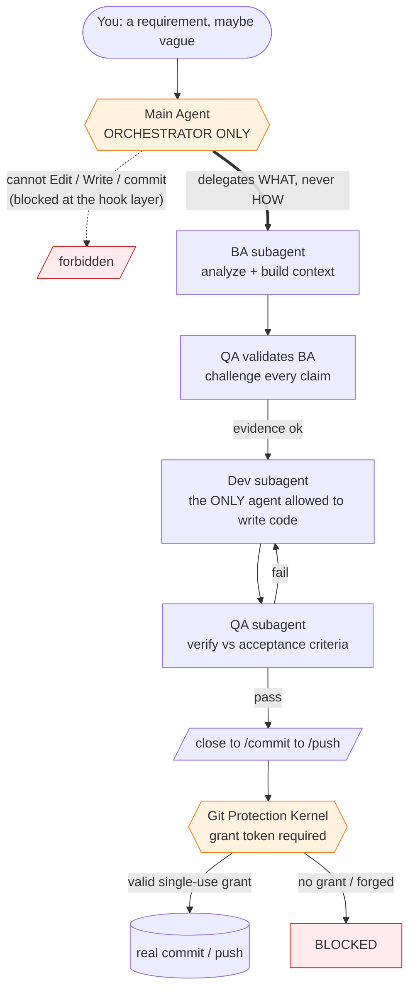
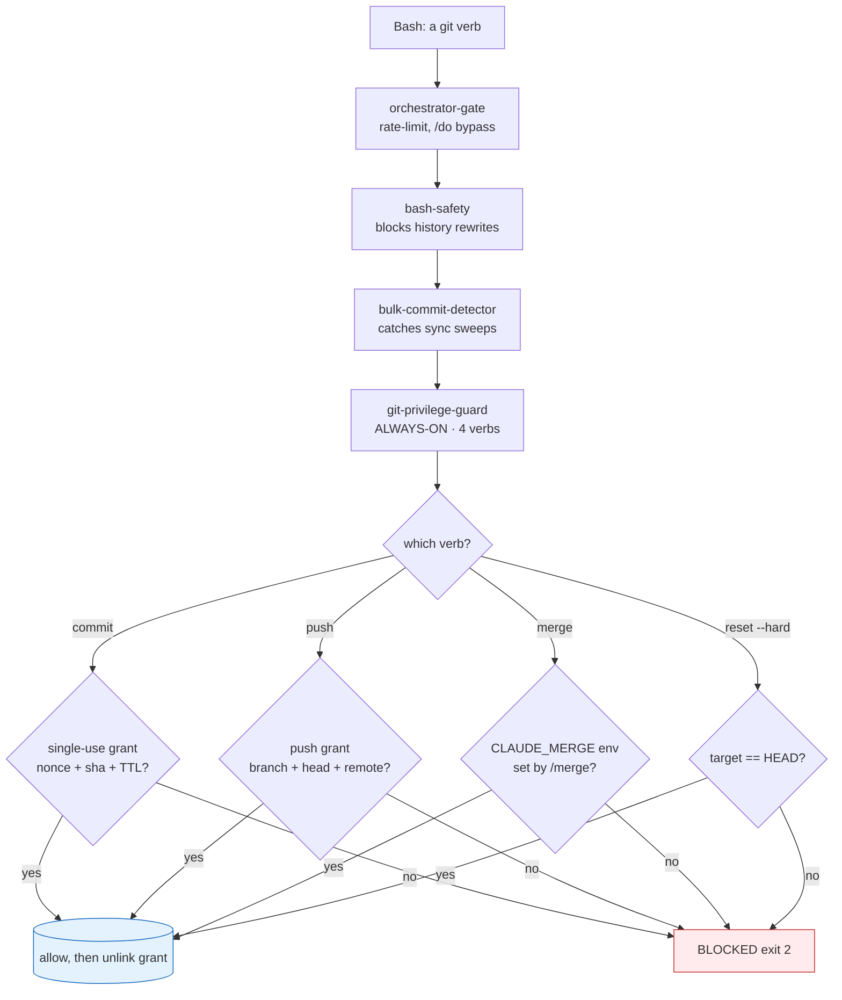
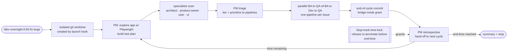

# `.claude` — A Self-Governing Agent Operating System for Claude Code

> **The orchestrator never touches your code. It hires specialists, gates every dangerous move at the kernel, and ships work while you sleep.**

This repository is a complete, battle-tested **Claude Code configuration** that turns a single chat agent into a disciplined software team: a main orchestrator that *delegates* every real change to specialized subagents, a defense-in-depth wall of **42 lifecycle hooks** that make catastrophic mistakes structurally impossible, and an autonomous overnight pipeline that explores a codebase, finds bugs, fixes them, verifies them, and commits them — unattended, until morning.

It is not a prompt pack. It is an operating system for agents, with a scheduler, a permission model, a filesystem layout, and a git protection kernel — assembled over **500+ commits** of real production use.

<p>
 
 
 
 
 

</p>

---

## Why this exists

Powerful coding agents fail in three predictable, expensive ways:

1. **They do too much themselves.** A single context window tries to analyze, implement, test, *and* commit — and quality collapses under the load.
2. **They make irreversible mistakes.** A stray `git reset --hard`, a force-push, a 93-file "sync" commit, a secret written to disk. One bad tool call and your history is gone.
3. **They drift from the requirement.** The thing that ships is a confident-sounding cousin of the thing you actually asked for.

This config attacks all three with **structure, not vibes**:

- **An orchestrator-only main agent** that is *mechanically prevented* from writing code, so the work always goes to a fresh, single-purpose specialist. (`hooks/pretool-orchestrator-gate.py`)
- **A git-protection kernel** of layered PreToolUse hooks that refuse `commit / push / merge / reset --hard` unless a single-use, cryptographically-bound grant token authorizes that exact action. (implementation entry points: `hooks/pretool-git-privilege-guard.py`, `hooks/pretool-bulk-commit-detector.py`)
- **A BA → QA-of-BA → Dev → QA pipeline** where every claim must carry evidence, the requirement's *verbatim* words are the binding contract, and the analysis is challenged *before* a line of code is written. (`commands/dev.md`, `agents/ba.md`, `agents/qa.md`)

The result: an agent you can hand a vague bug report to at midnight and find a verified, committed fix for in the morning — without ever worrying it nuked `main`.

---

## The big idea in one diagram



The main agent's job is to *think and route*. Every byte of code is written by a `dev` subagent in its own context. Every git mutation must pass through the kernel. This separation is enforced by hooks — not by asking the model nicely.

---

## Feature highlights

| Capability | What it gives you | Grounded in |
|---|---|---|
| **Orchestrator-only architecture** | The main agent delegates all real work; quality stays high because each subagent has one job and a clean context. | `hooks/pretool-orchestrator-gate.py`, `CLAUDE.md` |
| **Git protection kernel** | `commit/push/merge/reset --hard` are refused unless a single-use grant token authorizes that *exact* action. Force-pushes, history rewrites, and bulk "sync" commits are structurally blocked. | `hooks/pretool-git-privilege-guard.py`, `hooks/pretool-bulk-commit-detector.py` |
| **Autonomous overnight pipeline** | `/dev-overnight 6:00` runs an unattended explore → triage → fix → verify → commit loop in an isolated git worktree until a wall-clock end time. | `commands/dev-overnight.md`, `hooks/stop-overnight-timelock.py` |
| **Evidence-gated BA → Dev → QA** | The analysis is QA'd *before* coding; every factual claim needs proof (git blame, grep, import-chain), and the user's verbatim words are the binding spec. | `commands/dev.md`, `agents/ba.md`, `agents/qa.md` |
| **Branch / PR / worktree firewall** | Creating a branch, PR, or worktree is forbidden by default everywhere — with explicit human escape hatches (`/do`, `/allow`) and an overnight exception. | `hooks/pretool-block-branch-pr-worktree.py`, `hooks/pretool-block-enterworktree.sh` |
| **Sentinel-grant break-glass** | `/allow` writes a *structured* grant (`{op, target, args_contain}`) matched by command structure — never by fragile substring grep — and consumed on any terminal result. | `hooks/lib/allowlist.py`, `commands/allow.md` |
| **Crash-proof checkpoints** | After every ~10 file edits, a snapshot is written to `refs/checkpoints/<branch>` via git plumbing — recoverable, audit-friendly, and it never moves `HEAD`. | `hooks/posttool-git-checkpoint.sh`, `hooks/lib/checkpoint-core.sh`, `docs/reference/checkpoint-mechanism.md` |
| **Self-updating documentation** | Edit a command or agent and the `INDEX.md`, README stat blocks, and `CLAUDE.md` inventories regenerate automatically — preserving your hand-written prose. | `hooks/posttool-doc-sync.py`, `hooks/doc_sync/` |
| **Generated acceptance tests** | For risky/complex tasks, a `test-writer` agent emits pytest skeletons with `pytest.fail("TEST_INCOMPLETE:…")` hard-stops that Dev must satisfy. | `agents/test-writer.md`, `tests/generated/manifest.json` |
| **Adversarial second opinion** | Add `--codex` to `/dev`, `/close`, or `/commit` to run an OpenAI Codex round against the agent's draft before it's accepted. | `commands/dev.md`, `commands/codex.md` |
| **Deep research harness** | `/deep-search`, `/research-deep`, `/search-tree`, `/reflect-search` run fan-out, fact-checked, multi-source web research. | `commands/deep-search.md` |
| **UI-audit skill suite** | A Playwright-driven UI review suite — axe-core injection, APCA contrast, anti-pattern catalog, state matrix, token conformance, and a weighted beauty score. | `skills/` |

---

## How it actually works

### Walkthrough 1 — `/dev "the login button is misaligned on mobile"`

```
/dev the login button is misaligned on mobile
```

1. **The orchestrator parses, then delegates — it does not investigate.** A `UserPromptSubmit` hook pre-creates a `dev-registry/<session>/` of per-agent sentinel files and writes your verbatim requirement to disk as the source of truth. (`commands/dev.md` Step 1)
2. **Specialists are consulted (when relevant).** A misalignment-on-mobile report trips the `ui-specialist` trigger; the orchestrator must justify, per specialist, RELEVANT-or-SKIP — silently skipping is itself a violation. (`commands/dev.md` Step 3)
3. **The BA subagent builds the spec.** It does git root-cause analysis, finds the *actual* file (not a plausible-looking cousin), and emits a Markdown ticket plus a JSON context, scored on 5 clarity dimensions (What / Why / Where / Scope / Success). (`agents/ba.md`)
4. **QA validates the BA *before any code is written*.** It challenges every claim: "is there git-blame evidence? do these files exist? did the scope quietly narrow?" If not, BA is sent back to investigate. This catches a wasted Dev+QA cycle early. (`commands/dev.md` Step 7)
5. **The Dev subagent implements** — and it is the *only* agent the hooks permit to write `.css/.ts/.py/...` files. (`commands/dev.md` Step 10)
6. **QA verifies against acceptance criteria,** looping back to Dev on failure (bounded retries).
7. **`/close → /commit → /push`** lands the change through the git kernel — each step requiring its own grant token.

### Walkthrough 2 — a hook firing

You (the agent) try a shortcut:

```bash
CLAUDE_COMMIT_COMMAND_ACTIVE=1 git commit -m "fix stuff"
```

`hooks/pretool-git-privilege-guard.py` runs *before* the tool executes. It scans for the literal inline `CLAUDE_*_ACTIVE=` substring **before** even reading the env, recognizes the injection attempt, and returns exit 2 — **BLOCKED**. The only sanctioned path is a grant file written by the `/commit` wrapper, validated by nonce + 30-minute TTL + single-use unlink. (see `hooks/pretool-git-privilege-guard.py`, the inline-env-injection guard)

That is the whole philosophy in miniature: the model is *encouraged* toward the right path and *physically prevented* from the wrong one.

---

### The git protection kernel



Four PreToolUse hooks form a chain; the innermost (`git-privilege-guard`) is **always-on** and unaffected even by `/do` consent. Grants are per-nonce files (`/tmp/claude-{commit,push}-grant-<sid>-<nonce>.json`), single-use, and time-boxed. The design — 13 sanctioned/attack scenarios and 7 critical invariants — is implemented across the chain's entry points: `hooks/pretool-git-privilege-guard.py`, `hooks/pretool-bulk-commit-detector.py`, `hooks/pretool-orchestrator-gate.py`.

### The overnight autonomous pipeline



`/dev-overnight` runs a todo-completion-driven loop inside a dedicated worktree. A `Stop` hook (`hooks/stop-overnight-timelock.py`) physically refuses to end the conversation until your wall-clock end time, so the loop can't be short-circuited. Each issue gets its own one-issue-per-subagent pipeline; cycles deduplicate against state and end with a real, merge-ready commit. Cancel anytime with `/stop`.

---

## The cast: 23 subagents

The orchestrator dispatches specialists by *describing the problem* — never the tooling. Each picks its own approach and returns a structured report.

**Development pipeline**
- **`ba`** — requirements analyst; git root-cause analysis → Markdown ticket + JSON context.
- **`dev`** — implementation specialist; the *only* agent permitted to write code files.
- **`qa`** — verifier; validates analysis (pre-code) and implementation (post-code) against acceptance criteria.
- **`test-writer`** — emits pytest skeletons with `TEST_INCOMPLETE` hard-stops for risky/complex tasks.
- **`graphify`** — incremental code-graph enrichment; injects a focused subgraph into the Dev context.

**Exploration specialists (overnight + on-demand)**
- **`architect`** — structural issues, tech debt, dependency and pattern problems.
- **`product-owner`** — feature completeness, user flows, business-logic bugs.
- **`user`** — end-user simulation; UX friction and broken flows.
- **`ui-specialist`** — visual design quality + Playwright UI audit with a 1–10 beauty score.
- **`pm`** — test-plan manager with PLAN / TRIAGE / RETRO modes (explores the live app first).

**Git & release analysts**
- **`changelog-analyst`** — classifies files, stages surgically, writes conventional commits, emits push-gate tokens.
- **`push-analyst` / `merge-analyst` / `pull-analyst`** — pre-push, pre-merge, and post-pull risk analysis with nonce-keyed grants.

**Cleanup, audit & spec**
- **`cleaner` / `cleanliness-inspector` / `style-inspector` / `rule-inspector`** — the `/clean` cohort: detect, audit, and execute project hygiene.
- **`spec`** — splits a monolithic spec into per-agent views + Gawande-style checkpoints.
- **`prompt-inspector` / `git-edge-case-analyst`** — documentation verbosity and git-history edge-case discovery.

> Full, auto-maintained roster: [`agents/README.md`](agents/README.md).

---

## The command surface: 35 slash commands

| Group | Commands | What they do |
|---|---|---|
| **Develop** | `/dev` · `/redev` · `/dev-overnight` · `/spec` · `/spec-update` | Orchestrated single-pass and autonomous overnight development; spec authoring. |
| **Ship** | `/close` · `/commit` · `/push` · `/merge` · `/pull` · `/checkpoint` | The grant-gated git release pipeline. |
| **Quality** | `/clean` · `/test` · `/code-review` · `/refactor` · `/optimize` · `/security-check` | Cleanup cohort, test workflow, and review passes. |
| **Understand** | `/explain-code` · `/file-analyze` · `/doc-gen` · `/doc-sync` | Code explanation, file analysis (PDF/Excel/Word/images), documentation. |
| **Research** | `/deep-search` · `/research-deep` · `/search-tree` · `/reflect-search` · `/site-navigate` | Fan-out, fact-checked, multi-source web research. |
| **Control** | `/do` · `/allow` · `/stop` · `/codex` · `/quick-commit` · `/quick-prototype` | Break-glass consent, overnight cancel, Codex delegation, fast paths. |

`/do` and `/allow` are the two human escape hatches: `/do` lets the *main* agent bypass the orchestrator gate for one turn; `/allow` writes a single, structured break-glass grant for one specific command. Most release commands carry `disable-model-invocation: true` so an agent can never invoke them on itself — the human is the trust root.

> Full, auto-maintained list: [`commands/README.md`](commands/README.md).

---

## Quickstart

> **Requirements:** [Claude Code](https://claude.com/claude-code), Python 3 (a venv at `~/.claude/venv` powers the helper scripts), and `git`. The Playwright MCP and an OpenAI Codex CLI are optional (UI audits and `--codex` rounds).

```bash
# 1. Back up any existing config
mv ~/.claude ~/.claude.bak 2>/dev/null || true

# 2. Clone this repo to ~/.claude
git clone <this-repo-url> ~/.claude

# 3. Create the Python venv the scripts/hooks expect
python3 -m venv ~/.claude/venv

# 4. Start Claude Code — the SessionStart hooks announce the environment.
claude
```

The hooks are wired in `settings.json` and activate on the next session. Try them:

```bash
# Orchestrated development (vague requirements welcome)
/dev add a --dry-run flag to the export command

# Adversarial review enabled
/dev --codex fix the off-by-one in pagination

# Autonomous overnight run until 6am, focused on a subsystem
/dev-overnight 6:00 fix flaky tests in the parser

# Cancel an overnight session
/stop
```

> The grant-gated git pipeline (`/close → /commit → /push`) and several branch/worktree operations are tuned for this author's environment (notably a nested `.claude` repo on a RAM disk). Read [`CLAUDE.md`](CLAUDE.md) and adapt paths before relying on the release commands in your own setup.

### Troubleshooting

| Symptom | Fix |
|---|---|
| **A hook isn't firing** | Shell hooks must be executable: `chmod +x ~/.claude/hooks/*.sh`. The Python hooks run through the venv at `~/.claude/venv`. |
| **A slash command doesn't appear** | Check the YAML frontmatter at the top of the file in `commands/`; a malformed `---` block hides the command. |
| **`settings.json` won't load** | Validate it: `python3 -m json.tool ~/.claude/settings.json` — a trailing comma or unquoted key will surface here. |
| **Helper scripts fail to import** | They expect the venv at `~/.claude/venv`; recreate it with `python3 -m venv ~/.claude/venv` if it's missing. |

---

## Project structure

```text
.claude/
├── CLAUDE.md          # The constitution: non-negotiable rules the agent must obey
├── settings.json      # 42 wired hooks across 6 lifecycle events
├── agents/            # 23 subagent definitions (BA, dev, QA, architect, …)
├── commands/          # 35 slash-command workflows (/dev, /commit, /dev-overnight, …)
├── hooks/             # PreToolUse / PostToolUse / Stop gates — the enforcement layer
│   ├── lib/           #   shared libs: allowlist (sentinel grants), checkpoint-core
│   ├── doc_sync/      #   self-updating INDEX/README/CLAUDE regeneration
│   └── git-keystone/  #   git-native ref protection
├── scripts/           # 70+ helper scripts (graphify, spec resolver, grant writers, …)
├── skills/            # 8 skills: Playwright UI-audit suite
├── schemas/           # JSON schemas (e.g. cycle-contract.v1.json)
├── templates/         # spec + settings templates
├── tests/             # test infra; tests/generated/ holds AC-driven pytest skeletons
└── docs/              # architecture, incidents, references, design philosophy
```

A `PostToolUse` doc-sync hook keeps `INDEX.md` files and the inventory block below current automatically; manual prose outside the `<!-- AUTO:… -->` markers is always preserved.

<!-- AUTO:readme-stats -->

## Overview
- **Total files**: 16
- **Subdirectories**: 10
- **Naming convention**: lower

## Files
- `ARCHITECTURE.md` - Architecture — `.claude` Agent Operating System
- `CLAUDE.md` - CLAUDE.md
- `LICENSE` - unknown file
- `NESTED-REPO.md` - Nested Repo Sentinel
- `NOTICE` - unknown file
- `settings.json` - json config

## Subdirectories
- `agents/`
- `commands/`
- `docs/`
- `hooks/`
- `policies/`
- `schemas/`
- `scripts/`
- `skills/`
- `templates/`
- `tests/`

---
*Auto-generated by doc-sync hook.*
<!-- /AUTO:readme-stats -->

---

## Design philosophy

A few principles run through every file here. They are the taste behind the project.

**Rules, not stories.** Agent and command prompts state what is *required* and what is *forbidden* — tersely. Positive instructions alone are insufficient: every infrastructure-touching subagent prompt carries an explicit **DO NOT** section, because hard-won catastrophe lessons proved that "what's allowed" without "what's banned" leaks.

**Enforce in code, not in prose.** "Please don't force-push" is a wish. A PreToolUse hook returning exit 2 is a guarantee. Wherever a rule *can* be a hook, it *is* a hook — and the human escape hatches (`/do`, `/allow`) are themselves narrow, audited, and single-use.

**The orchestrator describes WHAT; the subagent decides HOW.** Dispatch prompts never name a tool or a shell command — `hooks/pretool-orchestrator-prompt-purity.py` watches for leaked "HOW". This keeps specialists free to choose their own toolchain and keeps the orchestrator honest about staying out of the work.

**One subagent, one task.** Never bundle issues. N issues → N parallel subagents, each with a clean context. Multitasking inside one subagent is banned outright — it's how quality silently degrades.

**The user's verbatim words are the contract.** The literal requirement is written to disk and re-read by every downstream agent. Paraphrase is drift; drift is how you ship the wrong thing confidently.

**Fail closed, leave forensics.** Ambiguous grant? Reject. Unparseable QA verdict? Treat as failure. But on rejection, leave the evidence (the grant file, the raw output) so a human can see exactly what happened.

---

## FAQ

**Is this a framework I import?** No. It's a *configuration* for Claude Code. You drop it at `~/.claude`, and its hooks + commands + agents change how the agent behaves. There's nothing to `npm install` into your app.

**Does the orchestrator-only rule make simple edits slow?** For a one-line fix you can `/do` to let the main agent act directly for a turn. The delegation overhead is the price of consistent quality on real tasks — and the autonomous loop pays for itself overnight.

**Can the agent disable its own guardrails?** That's the threat model the kernel is built against. Release commands are `disable-model-invocation: true` (an agent can't self-invoke them), the git privilege guard ignores `/do`, and grants are single-use and time-boxed. One honestly-documented residual (a shared `.git` common-dir during overnight worktrees) is called out, not hidden — see `commands/dev-overnight.md`.

**Is everything in this README real?** Yes — every capability traces to a file cited inline. A few items mentioned in older internal docs (e.g. a now-removed `orchestrator.md` agent, or a `subagentstop-cp-enforce.py` hook that is intentionally *not* wired) were deliberately left out of the claims above because the current code doesn't back them.

**Where do I go deeper?**
- The constitution: [`CLAUDE.md`](CLAUDE.md)
- System architecture: [`ARCHITECTURE.md`](ARCHITECTURE.md)
- Git protection kernel (13 scenarios, 7 invariants) — implementation entry points: [`hooks/pretool-git-privilege-guard.py`](hooks/pretool-git-privilege-guard.py), [`hooks/pretool-bulk-commit-detector.py`](hooks/pretool-bulk-commit-detector.py)
- Checkpoint mechanism: [`docs/reference/checkpoint-mechanism.md`](docs/reference/checkpoint-mechanism.md)

---

## Extending it

Everything here is plain Markdown and small scripts — adding your own piece is intentionally low-ceremony. A `PostToolUse` doc-sync hook re-inventories the roster the moment you save, so new commands and agents show up in the INDEX/README blocks without manual bookkeeping.

**Add a slash command** — drop a file in `commands/`:

```bash
cat > ~/.claude/commands/my-command.md << 'EOF'
---
description: My custom command
---

Your command instructions here…
EOF
```

**Add a subagent** — drop a file in `agents/`:

```bash
cat > ~/.claude/agents/my-agent.md << 'EOF'
---
name: my-agent
description: When the orchestrator should dispatch this agent
tools: Read, Write, Bash
---

Your agent system prompt here…
EOF
```

**Add a hook** — write the script, make it executable, then wire it into `settings.json` under the lifecycle event you want (`PreToolUse`, `PostToolUse`, `Stop`, …):

```bash
cat > ~/.claude/hooks/my-hook.sh << 'EOF'
#!/bin/bash
# Your hook logic here — exit 2 to block the tool call.
EOF
chmod +x ~/.claude/hooks/my-hook.sh
```

> Mirror the conventions of the existing files: command/agent prompts state what is **required** and what is **forbidden**, and a hook that guards anything dangerous should *fail closed* (block on doubt) and leave its evidence behind.

---

## Acknowledgements

This configuration grew out of, and remains grateful to:

- [Claude Code](https://claude.com/claude-code) and the official [documentation](https://docs.claude.com/en/docs/claude-code).
- [fcakyon/claude-codex-settings](https://github.com/fcakyon/claude-codex-settings) — an early real-world configuration reference.
- The broader Claude Code community, whose shared patterns and hard-won lessons are baked into the hooks and agents here.

---

## License

Released under the **MIT License** — free to use, copy, modify, and adapt for your own `~/.claude`. Source: [`Yugoge/awesome-claude-harness`](https://github.com/Yugoge/awesome-claude-harness).

---

<sub>Built and hardened over 500+ commits of daily use. Hooks, agents, and commands are auto-inventoried by the doc-sync system; the stat block above regenerates itself. Manual edits outside the `<!-- AUTO:… -->` markers are preserved.</sub>
