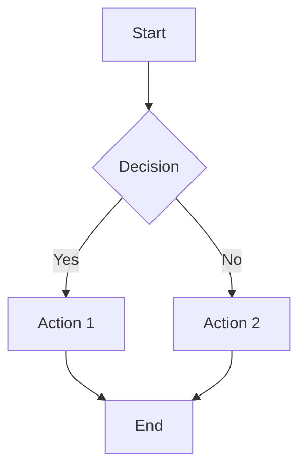
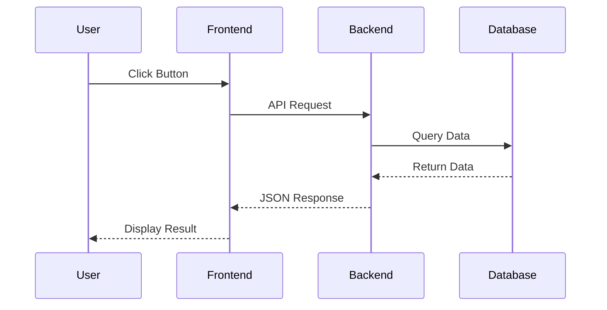
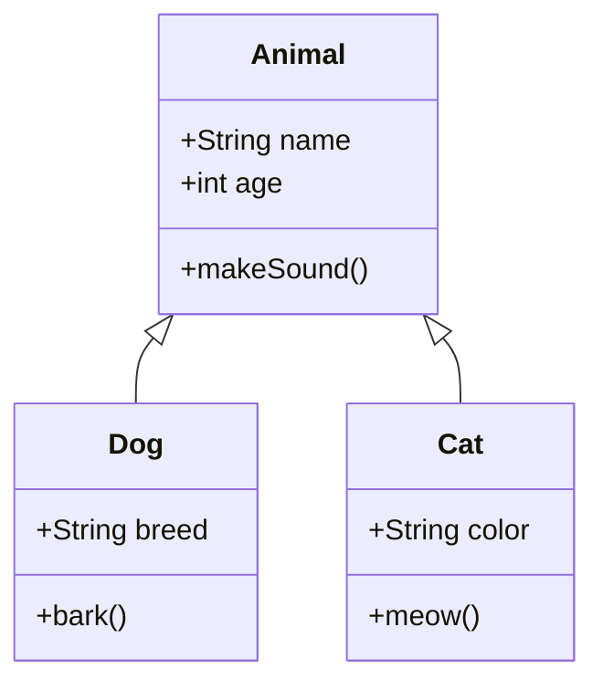
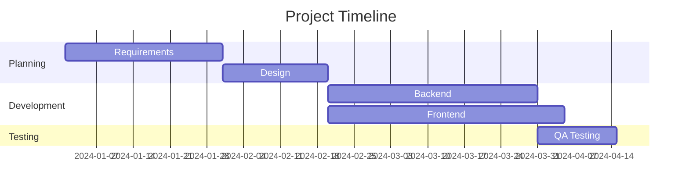
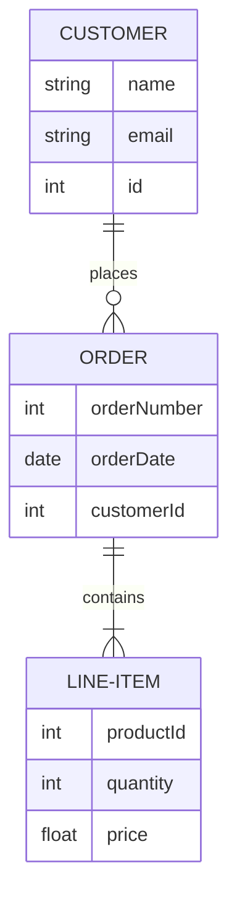

# Create Mermaid Diagram Artifact

Create a **standalone, interactive Mermaid diagram** as an HTML file.

## Supported Diagram Types:
- `flowchart` - Flowcharts and process diagrams
- `sequence` - Sequence diagrams
- `class` - Class diagrams
- `er` - Entity relationship diagrams
- `gantt` - Gantt charts
- `pie` - Pie charts
- `state` - State diagrams
- `journey` - User journey diagrams
- `git` - Git graphs

## User Requirements:
- Diagram type: $1
- Description: $2

## Template Structure:

```html
<!DOCTYPE html>
<html lang="en">
<head>
    <meta charset="UTF-8">
    <meta name="viewport" content="width=device-width, initial-scale=1.0">
    <title>Mermaid Diagram - {Type}</title>
    <script src="https://cdn.jsdelivr.net/npm/mermaid@10/dist/mermaid.min.js"></script>
    <script src="https://cdn.tailwindcss.com"></script>
    <style>
        .mermaid {
            background: white;
            border-radius: 8px;
            padding: 20px;
            box-shadow: 0 4px 6px -1px rgba(0, 0, 0, 0.1);
        }
    </style>
</head>
<body class="bg-gray-100 p-8">
    <div class="max-w-6xl mx-auto">
        <h1 class="text-3xl font-bold mb-6 text-gray-800">
            📊 Mermaid Diagram
        </h1>

        <div class="mb-6 p-4 bg-white rounded-lg shadow">
            <h2 class="text-xl font-semibold mb-2">Diagram Code</h2>
            <pre class="bg-gray-50 p-4 rounded overflow-x-auto"><code id="diagram-code"></code></pre>
            <button
                onclick="copyCode()"
                class="mt-2 bg-blue-600 text-white px-4 py-2 rounded hover:bg-blue-700"
            >
                📋 Copy Code
            </button>
        </div>

        <div class="mermaid">
            <!-- Mermaid diagram code goes here -->
        </div>

        <div class="mt-6 p-4 bg-blue-50 rounded-lg">
            <h3 class="font-semibold mb-2">💡 Tips:</h3>
            <ul class="list-disc list-inside text-sm text-gray-700 space-y-1">
                <li>Click and drag to pan the diagram</li>
                <li>Use the code above to modify the diagram</li>
                <li>Right-click on the diagram to save as image</li>
            </ul>
        </div>
    </div>

    <script>
        mermaid.initialize({
            startOnLoad: true,
            theme: 'default',
            securityLevel: 'loose',
            flowchart: {
                useMaxWidth: true,
                htmlLabels: true,
                curve: 'basis'
            }
        });

        const diagramCode = document.querySelector('.mermaid').textContent.trim();
        document.getElementById('diagram-code').textContent = diagramCode;

        function copyCode() {
            navigator.clipboard.writeText(diagramCode);
            alert('Diagram code copied to clipboard!');
        }
    </script>
</body>
</html>
```

## Example Mermaid Codes:

### Flowchart:


### Sequence Diagram:


### Class Diagram:


### Gantt Chart:


### ER Diagram:


## Instructions:
1. **Ask the user** what type of diagram they want and what it should show
2. **Generate the appropriate Mermaid code** based on their requirements
3. **Create the complete HTML file** using the template above
4. **Insert the Mermaid code** in the `<div class="mermaid">` section
5. **Save the file** using Write tool as `{diagram-type}-diagram.html`
6. **Tell the user**:
   - Where the file is saved
   - How to open it (double-click or `open filename.html`)
   - That they can modify the code directly in the HTML file

## Example Usage:
- `/artifact-mermaid flowchart "User login process"`
- `/artifact-mermaid sequence "API request flow"`
- `/artifact-mermaid er "Database schema for blog"`
