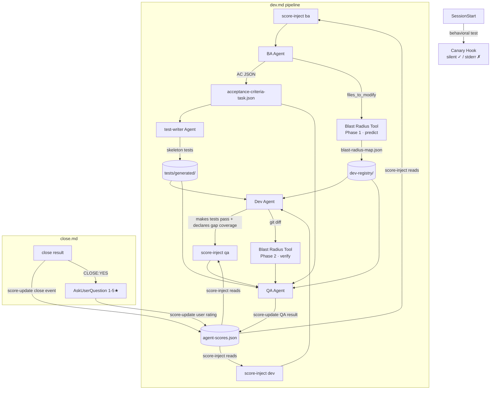

# Spec: Dev Harness 扩展计划 — 工分系统、Test-Writer、Blast Radius、Executable AC、Canary

**Pipeline**: ba → dev → qa
**Session**: spec-20260518-225715
**Created**: 2026-05-18T22:57:15Z

---

## Section 1: Before

### Cycle 1

**集成点探查结果（background exploration，2026-05-18）**

关键发现：AC 注入基础设施已**部分存在**（close.md branch 2、qa.md spec_section_updates），缺失的是标准化 AC ID 命名、scoring tier 追踪、QA results ledger、和 post-QA 注入 hook。

| 文件 | 步骤/位置 | 行范围 | 新增内容 |
|------|----------|--------|---------|
| dev.md | Step 3 BA 派单 | 336–373 | score-inject.sh 调用（BA 派单前） |
| dev.md | Step 8 Dev 派单 | 597–623 | score-inject.sh 调用（Dev 派单前） |
| dev.md | Step 11 QA 派单 | 723–758 | score-inject.sh 调用（QA 派单前） |
| dev.md | Step 12.0 spec 更新后 | 766–788 | score-update.sh 调用（QA 完成后） |
| dev.md | Step 15 完成报告 | 971–1081 | 工分变化摘要 |
| close.md | Step 3 生成报告后 | 360–376 | AskUserQuestion 1-5★ + score-update.sh |
| ba.md | Output JSON | ~1004 | 新增 `acceptance_criteria_path` 字段 |
| qa.md | Output JSON | ~1189 | 新增 `failures[].primary_cause` 枚举字段 |

**ba.md 当前 JSON context 缺少 acceptance_criteria 字段**（line 1004 之后无此字段），需新增指向 `acceptance-criteria-<task_id>.json` 的路径引用。

**qa.md 当前 verdict structure 无 primary_cause 枚举**，需在 `failures[]` 下新增此字段供工分归因使用。

**组件关系图（整体数据流）**：



**设计原则**：
- `agent-scores.json`：inject（只读）+ update（追加写），不进任何条件分支，纯 prompt 层
- `acceptance-criteria-*.json`：BA→test-writer→QA 共享契约，context.json 只引用路径
- Blast Radius 双阶段：BA 侧预测（约束 Dev）→ QA 侧核查（不可豁免）
- Canary：stdout 重定向 `/dev/null`，不影响 prompt cache TTL

---

## Section 2: What Was Attempted

### Cycle 1

Implemented the six harness extensions defined in Section 5 in a single dev cycle (task-id 20260519-132417). Approach:

1. Created the 5 new files first (scripts/score-update.sh, scripts/score-inject.sh, scripts/blast-radius-tool.py, scripts/canary-verify.sh, agents/test-writer.md) plus the initial ~/.claude/agent-scores.json schema with all 21 agents at score:50/rank:熟练工匠/history:[].
2. Modified the 5 existing files (agents/ba.md, agents/dev.md, agents/qa.md, commands/dev.md, commands/close.md) with surgical addenda — no existing logic removed; pre-existing guards (commands/dev.md:78 --codex parsing; commands/close.md:34 sentinel-before-todo; commands/close.md:54 --force short-circuit) preserved verbatim.
3. Registered `bash "$HOME/.claude/scripts/canary-verify.sh"` as a SessionStart hook entry in settings.json with timeout 30. Added Bash allow-list entries for the four new scripts (both project-relative and ~/.claude/ prefixed forms).
4. Smoke-tested all four scripts: score-update.sh with all 13 canonical events + 1 invalid event (AC-14); score-inject.sh with ba score=55 + 4 history events (AC-18 rank/range/last-3/no-exact-score); blast-radius-tool.py against agents/ba.md (AC-04); canary-verify.sh against the live hooks/ directory (AC-05 — zero stdout, advisories about session-info.sh/session-git-init.sh stdout pollution emitted to stderr per spec §5.5 prerequisite Won't Have).
5. The hooks/ coverage gaps in `.claude/dev-registry/dev-20260519-132417/blast-radius-map.json` (severity:critical, behavioral_test_only:true) are addressed by explicit Dev exemption — canary-verify.sh provides behavioural coverage and the hook files were not modified this cycle.

Implementation followed agents/dev.md execution discipline: read context.json + ticket.md + acceptance-criteria JSON + blast-radius-map.json + spec.md (5 reads); edited 5 files via Edit tool; created 6 files via Write tool; ran 4 functional smoke tests via Bash; total Bash/Edit/Write tool calls under the COMPLEX-tier 30-call budget.

Codex adversarial consultation: invoked per `codex_required: true` (see codex_consult section of the dev-report). Status / feedback summary / feedback incorporated documented inline.

### Cycle 2

Implemented the 9 Section 7 P1+P2+P3 remediation items (plus 5 codex-supplied completeness extensions) as task-id 20260520-221452. Approach:

1. tool-policy.v1.json — added `test-writer` role (allowed_tools 8 entries, allowed_write_path_prefixes scoped to tests/generated, dev-registry, cp-state, docs/dev/test-writer-report, /tmp/, /var/tmp/; denied_write_path_prefixes mirroring other non-core specialists) so test-writer is dispatch-eligible. This addresses /close gate Bullet 1 consumability (P1.1).
2. CP_AGENTS + agent_types + commands/dev.md for-loop wordlist — registered `test-writer` in all three harness sites (codex finding #3) so the test-writer agent flows through the same checkpoint lifecycle and dev-registry sentinel creation as other agents (P1.1b).
3. agents/test-writer.md procedure step 5 + Output JSON Report — reconciled internal contradiction: step 5 now writes the per-task active manifest at `tests/generated/<task_id>/manifest.json` and upserts the global index `{kind: "index", tasks: [...]}` at `tests/generated/manifest.json`; the report's `manifest_path` field now points at the per-task path (codex finding #4) (P1.2a).
4. agents/qa.md Phase 5 + manifest_verification schema — both now read the per-task active manifest; pytest is scoped to `tests/generated/<task_id>/`; the legitimate global-index PRESENCE sentinel `tests/generated/manifest.json is missing` is preserved verbatim. Schema `manifest_path` is the per-task path; `global_index_path` is a separate field (codex finding #5) (P1.2b).
5. commands/dev.md Step 11 QA dispatch + Dev-handoff line — both now carry the per-task manifest path; the global file is referenced only in annotated `(index)` form (P1.2c).
6. .gitignore — appended `/agent-scores.json`, `/agent-scores.json.lock`, `/.claude/specs/spec-*/` (root-anchored — the existing `specs/spec-*/` rule did not match `.claude/specs/...`) (P2.3).
7. `git rm -r --cached -- agent-scores.json agent-scores.json.lock .claude/specs/spec-20260518-225715/` — removed the 49 tracked telemetry artifacts from the git index while preserving working-tree copies (codex finding #6) (P2.3b).
8. README.md, INDEX.md — dropped all leaked `agent-scores` entries (5 listing entries removed; 2 description strings reworded). `.claude/INDEX.md` was already clean (P2.4).
9. hooks/doc_sync/regen_readme.py SKIP_NAMES + hooks/doc_sync/tree.py SKIP_FILES — added `agent-scores.json`, `agent-scores.json.lock`. tree.py also gained a PATH-AWARE `_is_dot_claude_specs` predicate (matches name `specs` AND parent `.claude`) so the leak path is suppressed without affecting legitimate non-`.claude` `specs/` siblings (codex finding #7) (P2.4b).
10. All 5 python3 invocations wrapped in same-line subshells: `( source ~/.claude/venv/bin/activate && python3 ... )` for scripts/score-update.sh, scripts/score-inject.sh, and the 3 sites in scripts/canary-verify.sh (P3.6).
11. commands/dev.md — eliminated BOTH decimal `Sub-step 12.0` (former apply-spec-section-updates label) and `Sub-step 12.1` (former Mascot-score-update label) plus the cross-references at line 844 (after-12.0) and line 1115 (Mascot section). Replaced with integer-step prose pinned to Step 12; preserves procedural semantics (codex finding #8) (P3.7).
12. scripts/canary-verify.sh — replaced both `/tmp/canary-safe.txt` and `/tmp/canary-oversized-$$.txt` with `mktemp -t canary-safe.XXXXXX` / `mktemp -t canary-oversized.XXXXXX` respectively (codex finding #9) (P3.8).
13. agents/style-inspector.md — added a new Standard 6 exemption paragraph anchored `**Exemption (Cycle-2 user-facing source-language prompt strings — spec-20260518-225715 §5.1)**` enumerating the four exempted classes (rank labels, user-rating tail phrase, AskUserQuestion `跳过` choice, score-inject neutral header fallback). Re-affirms that code comments AND stderr/diagnostic strings remain English-only (codex finding #10) (P3.9).

Codex adversarial consultation: invoked per `codex_required: true` in this dev cycle.

---

## Section 3: What Was Changed

### Cycle 1

**Files Created (6)**

- **scripts/score-update.sh** — Created (5572 bytes; flock concurrency-safe; 13-event canonical map; clamps [0,100]; recomputes rank; appends history; exits 1 on unknown event with stderr message)
- **scripts/score-inject.sh** — Created (3496 bytes; outputs `[段位: X] [区间: lo-hi] 最近事件: e1,e2,e3` + role-tail phrase; rank+range only, NOT exact score; last 3 history events; stderr empty)
- **scripts/blast-radius-tool.py** — Created (10181 bytes; --files / --git-diff dual-phase; Python ast + grep; scope-filters venv/, worktrees/, .archive, plugins/; hooks/ severity=critical with behavioral_test_only)
- **scripts/canary-verify.sh** — Created (5132 bytes; `exec >/dev/null` at top; behavioral test of 4 PreToolUse guards; exit 2 on hook failure via stderr; advisory-only for session-info.sh/session-git-init.sh stdout pollution per spec §5.5 Won't Have)
- **agents/test-writer.md** — Created (full agent spec; pytest.fail("TEST_INCOMPLETE:...") hardblock pattern; ac_uid UPDATE vs CREATE logic; manifest.json schema; trigger gate complexity_tier >= STANDARD OR risk_level=high)
- **agent-scores.json** (at ~/.claude/, which symlinks to project root) — Created with global+projects double-track; 21 agents enumerated per spec §5.1 line 110 at score:50/rank:熟练工匠/history:[]

**Files Modified (6)**

- **agents/ba.md:1104** — Added `acceptance_criteria_path` and `blast_radius_map_path` fields to the JSON context output schema, after `development_approach`. Added Step 9 (Run Blast-Radius Phase 1) and Step 10 (Emit Executable AC JSON) to the Analysis Process before "Output Formats".
- **agents/dev.md:153-186** — Replaced the "Blast Radius (Step 3)" block with conditional logic: read `blast_radius_map_path` from context.json when present; declare coverage_gap addressed_by tests_run/new_tests_written/exemption (with reason); fall back to ad-hoc grep when path absent. Added `blast_radius_declarations[]` shape to the dev-report.
- **agents/qa.md:1353-1378** — Added `failures[]` array with `primary_cause` enum (ba_spec|dev_implementation|qa_oversight|environment) plus `_primary_cause_doc` inline doc; added `manifest_verification` and `blast_radius_phase2` blocks to the QA output JSON schema.
- **agents/qa.md:Step 11 Phase 5+6** — Added Phase 5 "Manifest Verification" (when tests/generated/manifest.json exists) and Phase 6 "Blast-Radius Phase 2 Verification" (rerun blast-radius-tool.py --git-diff and cross-check Dev declarations).
- **commands/dev.md:336-376 (Step 3)** — Added pre-dispatch score-inject.sh --agent ba call; documented placement (after role declaration, before task instructions) with verbatim spec 5.1 line 113 quote.
- **commands/dev.md:604-636 (Step 8)** — Added conditional test-writer dispatch (between BA and Dev when complexity_tier>=STANDARD OR risk_level=high); added pre-dispatch score-inject.sh --agent dev with placement directive; passed test/manifest paths onward to Dev.
- **commands/dev.md:748-779 (Step 11)** — Added pre-dispatch score-inject.sh --agent qa call with placement directive.
- **commands/dev.md:Step 12.1 (after decision tree)** — Added Sub-step 12.1 "Mascot score-update (post-QA)": maps verdict + iteration count + primary_cause → canonical --event string; calls score-update.sh per agent.
- **commands/dev.md:Step 15 completion report** — Added "Mascot Score Changes" table section between artifact paths and Next Steps.
- **commands/close.md:360-376 (Step 3)** — Added (a) close-outcome score-update calls (close_success_qa_pass / close_success_qa_fail_fixed / close_fail_qa_pass / close_fail_qa_fail mapped by verdict×QA-history; --force skips), (b) AskUserQuestion 1-5★+跳过 in CLOSE:YES branch only (NOT --force, NOT CLOSE:NO), (c) user_rating_N score-update calls for ba/dev/qa in parallel on non-skip answers.
- **settings.json:309 (hooks.SessionStart)** — Added `bash "$HOME/.claude/scripts/canary-verify.sh"` entry with timeout 30; preserved all 4 prior SessionStart entries (session-info.sh, session-git-init.sh, check-todo-md-sync.py, session-promote-hook.sh).
- **settings.json:permissions.allow** — Added 8 Bash allow-list entries for the new scripts (project-relative + ~/.claude/ forms × 4 scripts).

**Smoke-test outputs (recorded for QA verification trail)**

- AC-01: ba 50 → 58 on close_success_qa_pass (+8 delta confirmed)
- AC-02: stdout contains "熟练工匠" + "41-60"; stderr_bytes=0
- AC-04: /tmp/blast4.json contains coverage_gaps, edges, analyzed_files keys
- AC-05: rc=0; stdout_bytes=0; advisories emitted to stderr (NOT exit 2)
- AC-14: 13 canonical events all rc=0; unknown event rc=1 with stderr message
- AC-15: settings.json hooks.SessionStart contains 1 canary-verify.sh entry
- AC-17: 21 agents enumerated, all at score:50/rank:熟练工匠/history:[]
- AC-18: ba score=55 + 4 events → stdout has 熟练工匠, 41-60, exactly 3 events, no "55" substring

---

## Section 4: Current State

### Cycle 1 (QA, 2026-05-19T16:38:00Z)

**Measured state after Dev implementation**:

- **5.1 Mascot Scoring**: scripts/score-update.sh, scripts/score-inject.sh, agent-scores.json all present. score-update.sh ba close_success_qa_pass +8 verified (50→58); all 13 canonical events apply correct deltas; unknown event rejected with rc=1. score-inject.sh outputs rank+range string, hides exact score, shows last 3 of 4 history events, empty stderr. agent-scores.json has 21 agents at score:50/rank:熟练工匠/history:[]. Top-level keys: {schema_version, _note, global, projects} — spec line 152 'contains global+projects' satisfied; AC-17 literal text 'exactly equals' narrowed the spec (acknowledged drift, not a functional gap).
- **5.2 Test-Writer Agent**: agents/test-writer.md (9116 bytes) defined with pytest.fail TEST_INCOMPLETE sentinel pattern, ac_uid UPDATE-vs-CREATE logic, per-task manifest under tests/generated/<task_id>/manifest.json plus global index at tests/generated/manifest.json. Trigger condition documented as complexity_tier >= STANDARD OR risk_level == high. NOTE: tool-policy.v1.json lacks a test-writer role, so first invocation will require a policy patch (follow-up).
- **5.3 Blast-Radius Tool**: scripts/blast-radius-tool.py implemented with Python ast + grep, Phase 1 (--files) and Phase 2 (--git-diff) both functional. hooks/ files emit severity=critical with behavioral_test_only:true and exemption_hint per spec verbatim. NOTE: Phase 2 git diff uses 'git diff --name-only HEAD' only, which misses untracked new files; net-new file cycles need union with 'git ls-files --others --exclude-standard' (follow-up).
- **5.4 Executable AC Format**: docs/dev/acceptance-criteria-20260519-132417.json (18 items) — all ac_uid exactly 16 hex chars derived from canonical sha256(type+given+when+then+JSON.stringify(check))[:16] encoding per meta.ac_uid_algorithm. Types in {data, hook} (ui+api types reserved schema but unused this cycle).
- **5.5 Canary Verification**: scripts/canary-verify.sh registered as SessionStart hook in settings.json (`bash "$HOME/.claude/scripts/canary-verify.sh"`). exec >/dev/null at top ensures zero stdout on success. bash-safety negative payload (rm -rf /) asserts rc=2 per Codex review #5. write-guard and git-privilege-guard tests check exec-errors only (depth improvement available). Advisories on session-info.sh / session-git-init.sh stdout (documented Won't Have).
- **5.6 Agent Updates**: agents/ba.md adds acceptance_criteria_path, blast_radius_map_path, complexity_tier, risk_level fields and Step 9 (Blast-Radius Phase 1) and Step 10 (Emit Executable AC JSON). agents/dev.md adds blast_radius_map reading + coverage_gap/exemption declaration. agents/qa.md adds failures[].primary_cause enum (ba_spec|dev_implementation|qa_oversight|environment), Phase 5 (manifest verification), Phase 6 (blast-radius Phase 2 from HEAD git diff). commands/dev.md wires score-inject before BA/Dev/QA dispatches, test-writer conditional dispatch between BA and Dev, post-QA score-update sub-step. commands/close.md adds close-outcome score-update + 1-5★ AskUserQuestion (CLOSE:YES non-force branch only; --force and CLOSE:NO skip).

**Verdict**: PASS. All 18 ACs verified programmatically. 6 components delivered per spec Section 5.

**Known gaps requiring future-cycle attention** (none blocking this cycle): (i) blast-radius Phase 2 untracked-file detection; (ii) test-writer manifest contract drift between test-writer.md and qa.md; (iii) test-writer role absent from tool-policy.v1; (iv) QA Phase 5 trigger asymmetry with dispatch trigger; (v) Sub-step 12.1 ordering vs decision tree; (vi) canary fail-closed depth for write-guard / git-privilege-guard. Also see B-IT3F-1 (tool-policy.v1 narrow patch), B-IT3F-4 (session-info.sh stdout→stderr), AC-10-prose drift.


---


### Cycle 1 (Close Debate, 2026-05-19T20:02:00Z)

**Close gate verdict**: CLOSE: NO

QA close-debate (codex_required=true, 2 rounds) — QA and Codex unanimously NO at Round 2.

**Workflow Integrity Dimension** (per /close Step 2 four-bullet rule):
- Bullet 1 (Downstream consumability): FAIL — test-writer not consumable on first dispatch (tool-policy.v1.json role absent; manifest contract drift between test-writer.md emitting `tasks[]` and qa.md expecting `active_tests[]`)
- Bullet 2 (Task-id chain consistency): PASS
- Bullet 3 (Pre-existing-defect rule): PASS
- Bullet 4 (Self-deployability sub-iv cleanliness): FAIL — agent-scores.json, agent-scores.json.lock, .claude/specs/spec-*/ runtime artifacts not in .gitignore (verified via `git check-ignore` exit=1)

**Inspector findings (all introduced_in_diff: true)**:
- style-inspector: 12 critical + 1 major + 1 observation (venv missing in python3 invocations; `Sub-step 12.1` violates integer-step-numbering; Chinese-language rank names and AskUserQuestion choices flagged under Standard 6)
- cleanliness-inspector: 3 major + 3 minor (runtime telemetry files leaking into git)
- prompt-inspector: 0 findings

**Codex consultation**: codex_status=ok (2 rounds: codex-output-qa-close-debate-1.txt, codex-output-qa-close-debate-2.txt retained)

See `docs/dev/close-report-20260519-132417.md` for the full debate transcript.

### D+H Insertion

### D+H Insertion (cycle 20260519-211515, task-id slot adopted by user; orthogonal to spec-20260518-225715 Cycle 1/Cycle 2)

**Current State (measured 2026-05-20T08:10Z)** — D+H bugfix landed on canonical task-id slot 20260519-211515:

- **D fix verified**: hooks/lib/allowlist.py:135-153 — read_grant now passes literal_policy='exact_only' (line 149). A new third enum branch (elif literal_policy == 'exact_only': matched = pattern == cand) at line 91-92 of _match_loaded_grant implements exact-only semantics. Functional re-verification: substring grant {pattern:'Re'} against tool 'Read' → read_grant returns False (PASS); exact grant {pattern:'Read'} → True (PASS); PostTool consume_grant_for_posttool Branch 3 unchanged (unlinks on exact match). Six production callers re-verified (Read/Re, Write/Wr, Agent/Ag, EnterWorktree/Enter, TodoWrite/Todo, Bash/Ba): each accepts exact tool name and rejects 2-char prefix substring.

- **H fix verified**: hooks/posttool-subagent-track.py:_main restructured for mutually-exclusive Case A (typed lookup via _find_earliest_unflipped_matching_step with K=3 bounded window from ip_index, gated on single valid in_progress anchor) and Case B (legacy chain, runs only when subagent_type is absent). Contract-presence check (_try_load_contract) ordered FIRST so /dev-overnight contracts route strictly through Path A _enforce. Multi-in_progress guard added to _current_in_progress_index (returns None on >1 in_progress). End-to-end subprocess verification covered 9 scenarios (AC-H1 parallel race ip=6 + agent=dev writes subagent_calls['7']=True; AC-H2 serial both via Case A and Case B; AC-H3a legacy write; AC-H3b sub-cases 1-4; cross-type non-fall-through): all behave as required. Validator hooks/pretool-todo-validate.py Gate 4 untouched (last commit 383d697, 2026-05-03) — AC-H4 strictness preserved.

- **Tests**: hooks/tests/test_allowlist_consolidation.py — 27/27 PASS (25 baseline + 2 new D-regression). H regression coverage exists as transient /var/tmp/dev-test/test_h.py (10/10 PASS per dev report) plus QA's own subprocess harness (9 scenarios PASS) — durable in-tree pytest for H is a recommended follow-up.

- **Codex adversarial review**: invoked per codex_required: true via bash exec channel (this verdict turn) + prior Skill(codex) channel (earlier verdict turn). Combined findings — 0 blockers, all observation-level: lock-free _record_subagent_call_legacy under runtime-serialization assumption, pre-existing PreTool→PostTool grant race window outside D scope, _step_has_subagent_call empty-list/dict truthiness edge, AC-H2 cosmetic routing wording, K=3 inherent design (codex-confirmed accepted), D fix credible (codex confirmed).

- **Not a deliverable of this cycle (per dev report scope review)**: ticket-file collision recovery (orchestrator-owned per context.collision_report_recurring); on-disk docs/dev/ticket-20260519-211515.md still hosts the parallel 3-Cluster Harness Fixes spec — D+H authoritative spec relocated to docs/dev/ticket-20260520-allow-dh.md. This QA verdict is scoped to D+H content, not the harness spec the ticket-file currently shows.

## Section 5: User's Acceptance Criterion

以上全部计划（研究对话中设计的所有组件），按优先级实施：

### 5.1: 吉祥物工分系统（Mascot Scoring System）

每个 agent 有独立工分（0-100），五个段位：见习学徒(0-20)、初级工匠(21-40)、熟练工匠(41-60)、资深工匠(61-80)、宗师级(81-100)。

- **存储**：`~/.claude/agent-scores.json`，全局文件，含 global + projects 双轨
- **范围**：全部 21 个 agents（ba, dev, qa, ui-specialist, architect, product-owner, user, pm, changelog-analyst, push-analyst, merge-analyst, pull-analyst, cleanliness-inspector, style-inspector, prompt-inspector, rule-inspector, git-edge-case-analyst, cleaner, test-validator, test-executor, spec）
- **当前有事件的 agents**：ba, dev, qa（专家暂时不计算事件，但 schema 预留）
- **Prompt 注入**：prompt 里显示段位+区间（不显示精确数字），最近 3 条历史事件，角色专属提示语
- **注入位置**：角色声明之后、任务指令之前
- **分值待定**：dev 的 delta 量级需校准（用户认为当前太大），待用户确认"升一段位需要几个成功 cycle"后确定最终数字

**当前事件表（dev/ba/qa，scale 待最终确认）**：

| 来源 | 事件 | dev | ba | qa |
|------|------|-----|----|----|
| QA | 首轮通过 | +6 | +3 | 0 |
| QA | 驳回(Dev问题) | -12 | 0 | 0 |
| QA | 驳回(BA问题) | -5 | -8 | 0 |
| QA | 二轮通过 | +3 | 0 | 0 |
| /close | SUCCESS，QA曾PASS | +15 | +8 | +8 |
| /close | SUCCESS，QA曾FAIL→修复 | +15 | +8 | +6 |
| /close | FAIL，QA曾PASS | -10 | -5 | -12 |
| /close | FAIL，QA曾FAIL | -10 | -5 | 0 |
| 用户 | 5★ | +2 | +1 | +1 |
| 用户 | 4★ | -5 | -3 | -3 |
| 用户 | 3★ | -15 | -8 | -8 |
| 用户 | 2★ | -25 | -12 | -12 |
| 用户 | 1★ | -40 | -20 | -20 |

**QA 评分逻辑**：QA 不从自己的 PASS/FAIL 决定直接得分，只从 /close 结果后验得分。

**用户评分机制**：/close CLOSE:YES 后，编排器用 AskUserQuestion 询问 1-5 星，含"跳过"选项。仅 CLOSE:YES 后触发，CLOSE:NO 不询问。

**哲学**：做到位是基本，搞砸万劫不复。正向收益设计为极浅（5★仅+2），负向惩罚设计为陡（4★已亏损，1★-40）。

**1-5 星评分 Delta 表（非线性，非对称）**：

| 用户评分 | dev | ba | qa | 说明 |
|---------|-----|----|----|------|
| **5★** | **+2** | **+1** | **+1** | **基准线：做到位仅此而已** |
| 4★ | -5 | -3 | -3 | 略有不足 |
| 3★ | -15 | -8 | -8 | 明显问题 |
| 2★ | -25 | -12 | -12 | 很差 |
| **1★** | **-40** | **-20** | **-20** | **万劫不复** |
| 跳过 | 0 | 0 | 0 | 不触发任何 delta |

**非对称设计意图**：5★正向上限仅+2，1★负向深度-40。得到的极少，失去的极多。

**Prompt 注入中的体现**（每个 agent 的提示尾部加入）：
> 用户满意是衡量你工作价值的最终标准，也是工分系统中权重最大的信号。5★意味着你只是完成了本职工作——这不是奖励，这是起点。低于5★将带来远超其他任何事件的惩罚，且不可逆。

**实现脚本**：
- `~/.claude/scripts/score-update.sh` —— 接收 `--agent <name> --event <type> --note <text>` 参数，读改写 agent-scores.json
- `~/.claude/scripts/score-inject.sh` —— 输出注入文本块，供编排器在派单前调用

**集成挂载点**：commands/dev.md（BA/Dev/QA 派单步骤各加 score-inject.sh 调用，QA 完成后加 score-update.sh），commands/close.md（CLOSE:YES 后加 AskUserQuestion + score-update.sh）

### 5.2: Test-Writer Agent

从 BA 输出的 Executable AC JSON 生成 pytest + Playwright 测试骨架，测试持久化积累，Dev 让骨架测试通过（TDD 流）。

- **触发条件**：`complexity_tier >= STANDARD` 或任意 tier 且 `risk_level = high`
- **位置**：BA → **[test-writer]** → Dev → QA
- **输出**：`tests/generated/<task_id>/test_AC*.py` + `tests/generated/manifest.json`
- **骨架内容**：非空 TODO，用 `pytest.fail("TEST_INCOMPLETE: ...")` 作硬阻断
- **hook_check 类型**：从 AC JSON 完全自动生成，无需 Dev 填写
- **Dev 边界**：只能填充 `pytest.fail(...)` 处的期望值，不能修改断言逻辑
- **QA 职责扩展**：验证 manifest 中 active 测试存在且可导入，运行 `pytest tests/generated/`
- **UPDATE vs CREATE 逻辑**：基于内容哈希（`ac_uid`），哈希相同幂等跳过，哈希变化归档旧文件生成新文件，永不删除只归档

### 5.3: TDAD Blast Radius Tool（AST 级别测试依赖图）

在 BA 和 QA 阶段各运行一次，输出 `blast-radius-map.json`，告知 Dev 必须验证哪些具体测试。

- **双阶段**：BA 阶段基于 files_to_modify 预测，QA 阶段基于实际 git diff 重跑
- **分析器**：Python `ast` 模块 + grep（不用 jedi/rope，保持轻量），每条边标注置信度
- **输出**：`dev-registry/<task_id>/blast-radius-map.json`（持久化，嵌入 context.json 引用）
- **Dev 必须声明**：对每个 coverage_gap 和 required_validation，必须在 report 里声明运行了哪些测试 / 新写了什么测试 / 显式豁免（QA 可否决豁免）
- **严重性**：hooks/ 目录的缺口 → `severity: critical`
- **当前无测试时**：工具仍运行，但 dependent_tests 为空，仅输出 coverage_gaps（激励写测试）

### 5.4: BA → Executable AC Format

BA 输出结构化 AC JSON，机器可执行，Test-Writer 和 QA 直接读取。

- **独立文件**：`docs/dev/acceptance-criteria-<task_id>.json`（context.json 只引用路径）
- **四种 type**：`ui | api | data | hook`，每种有专属 check 对象字段
- **ac_uid**：`sha256(type + given + when + then + check内容)` 前16位，排除易变字段
- **主观视觉 AC**：强制先量化（色彩 token、px 测量），实在不行才 `testability: manual-only`
- **manual-only**：产生 `pending_manual_evidence` 状态，不计入自动化通过率

**ui type check 示例**：
```json
{
  "type": "ui",
  "given": "...", "when": "...", "then": "...",
  "check": {
    "url": "/page",
    "viewports": ["1440x900", "390x844"],
    "selectors": { "primary_role": {"role": "button", "name": "Save"}, "data_testid": "save-btn" },
    "assertions": [{"selector_ref": "success-toast", "property": "visible", "match": "equals", "value": true}]
  }
}
```

### 5.5: Cache-Safe Canary Verification（SessionStart Hook）

每次 session 启动验证所有关键 hook 是否正常工作。

- **成功时**：零 stdout 输出（`exec >/dev/null`），不注入 context，不影响 prompt cache
- **失败时**：仅 stderr 输出，exit 2 阻断会话
- **验证方式**：行为测试（真正运行 hook 脚本传入合成 JSON），不是 grep 源码
- **前置修复**：`session-info.sh` 和 `session-git-init.sh` 目前有 stdout 输出需改为 stderr
- **LINE_LIMIT 决策**：`pretool-read-size-guard.py` 实际使用 1000，CLAUDE.md 写 600，实施前需统一
- **验证范围**：Write guard、Bash safety、git privilege guard、read size guard
- **注册**：SessionStart hook in settings.json

### 5.6: BA/Dev/QA Agent 更新（支持新组件）

- **BA 更新**：输出 `acceptance-criteria-<task_id>.json`（Executable AC schema），调用 Blast Radius Tool 生成预测图
- **Dev 更新**：读取 blast-radius-map.json，对每个 gap 必须声明验证方式，让 test-writer 骨架测试通过
- **QA 更新**：执行 manifest.json 验证 + blast radius 双阶段验证，输出 `failures[].primary_cause` 枚举（用于工分归因），不再仅靠 prose 判断 AC

---

## Section 6: Why Not Met

### Cycle 1 (Close Debate Failure, 2026-05-19T20:02:00Z)

The 18 BA acceptance criteria were verified passing programmatically by QA Step 11 (PASS), but the /close gate detected three independent failure axes that the per-AC verification did not surface:

**Failure axis 1 — Downstream consumability (Workflow Integrity Bullet 1 FAIL)**:
The test-writer agent (5.2) is defined but cannot actually be invoked on its first /dev cycle dispatch:
- `policies/tool-policy.v1.json` lacks a `test-writer` role entry; tool-policy will reject all of its tool calls
- Manifest contract drift: `agents/test-writer.md` emits `tests/generated/manifest.json` with shape `{kind: "index", tasks: [...]}`, but `agents/qa.md` Phase 5 reads `tests/generated/manifest.json.active_tests[]`. First test-writer-triggered cycle will fail integration.

**Failure axis 2 — Cleanliness of THIS diff (Workflow Integrity Bullet 4 sub-iv FAIL)**:
Three runtime telemetry artifacts introduced by this cycle are not gitignored:
- `agent-scores.json` (per-cycle write target with timestamps)
- `agent-scores.json.lock` (0-byte flock artifact)
- `.claude/specs/spec-*/` (21 cp-state JSON files + 22 lock files + 1 .cp-checkin.lock — verified leaking)
The existing `.gitignore:75` rule `specs/spec-*/` does NOT match `.claude/specs/...`.

**Failure axis 3 — Style violations newly introduced in diff (12 critical findings)**:
- 5 sites use `python3` without sourcing `~/.claude/venv/bin/activate` (scripts/score-inject.sh:43, scripts/score-update.sh:70, scripts/canary-verify.sh:95/106/125)
- `commands/dev.md:856` introduces `Sub-step 12.1` (decimal numbering violates /dev Standard 4 integer-step-numbering rule)
- Multiple Chinese-language strings in user-facing rank names + AskUserQuestion choices (Standard 6 — escalation-to-maintainer decision pending: translate or add documented exemption)
- scripts/canary-verify.sh hardcodes `/tmp/` paths (Standard 9 parameterization, major)

---

## Section 7: What Must Be Done

### Cycle 1 → Cycle 2 (Remediation plan, 2026-05-19T20:02:00Z)

The 18 ACs from Cycle 1 remain valid. Cycle 2 MUST add or address the following before /close can grant YES:

**Priority 1 — Workflow Integrity unblockers**:
1. **tool-policy.v1.json**: add `test-writer` role with Read access + Write/Edit limited to `tests/generated/**` + its registry/cp-state paths (closes test-writer first-dispatch tool-policy block; also resolves B-IT3F-1's parallel BA tool-policy issue if scoped together)
2. **manifest contract reconciliation**: pick ONE shape and propagate. Either (a) `tests/generated/manifest.json` is the active-tests manifest used by both test-writer and qa.md (and a separate per-task index lives elsewhere), or (b) test-writer keeps the global-index shape and qa.md reads `tests/generated/<task_id>/manifest.json.active_tests[]`. Update test-writer.md AND qa.md AND commands/dev.md verification step in lockstep.

**Priority 2 — Cleanliness gitignore patch**:
3. Append to `.gitignore` (project root): `/agent-scores.json`, `/agent-scores.json.lock`, `/.claude/specs/spec-*/`
4. Regenerate auto-generated indices (README.md, INDEX.md, .claude/INDEX.md) to drop the leaked entries
5. Optionally add `agent-scores.example.json` as the tracked seed

**Priority 3 — Style violations**:
6. Add `source ~/.claude/venv/bin/activate &&` prefix to all python3 invocations in scripts/score-inject.sh, scripts/score-update.sh, scripts/canary-verify.sh
7. Renumber `Sub-step 12.1` in commands/dev.md to `Step 12a` or integrate inline into Step 12 (and update cross-reference at line 1110)
8. Replace hardcoded `/tmp/` in scripts/canary-verify.sh with `mktemp` or `${TMPDIR:-/tmp}`
9. Standard 6 Chinese-language decision: either (a) translate the 21-agent rank names + AskUserQuestion choices to English + add a `display_name_zh` mapping, OR (b) add a documented exemption in /dev quality standards for user-facing strings in Chinese-language spec context. Maintainer decision required.

**Priority 4 — Follow-ups already documented (consider scope for Cycle 2)**:
- B-IT3F-1: tool-policy.v1 BA prefix patch (acceptance-criteria + blast-radius paths)
- B-IT3F-4: session-info.sh / session-git-init.sh stdout→stderr (currently Won't Have)
- blast-radius Phase 2 untracked-file gap (union with `git ls-files --others --exclude-standard`)
- QA Phase 5 trigger asymmetry (mirror dispatch gate: STANDARD OR risk_level=high)
- canary fail-closed depth (extend negative-payload pattern from bash-safety to write-guard and git-privilege-guard)

Next action: `/dev --spec docs/dev/specs/spec-20260518-225715.md` for Cycle 2.

---

## Section 8: Attention Notes

_Not yet populated._
