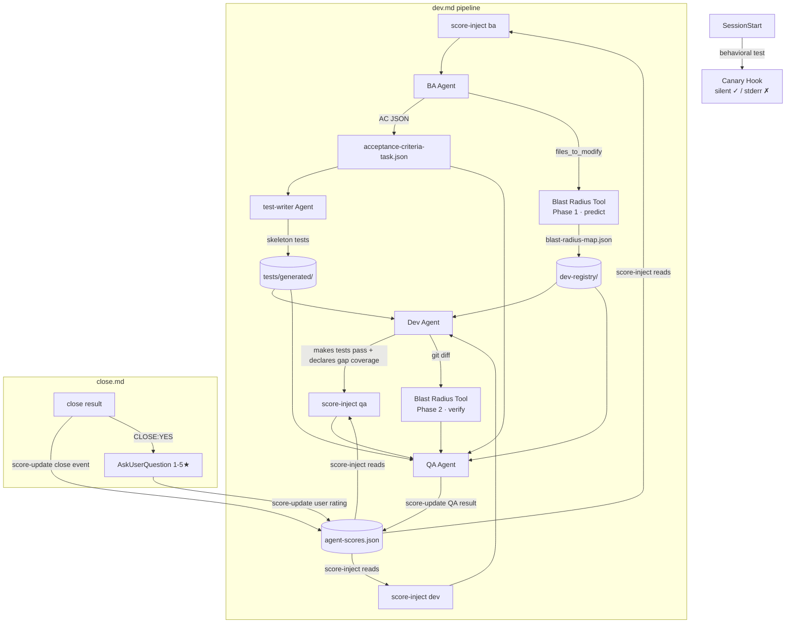

<!-- AUTO-GENERATED VIEW for orchestrator | source: docs/dev/specs/spec-20260518-225715.md | extracted: 2026-05-19T00:00:00Z -->

# orchestrator view of spec-20260518-225715

**Monolith**: docs/dev/specs/spec-20260518-225715.md

---

## Spec Header

# Spec: Dev Harness 扩展计划 — 工分系统、Test-Writer、Blast Radius、Executable AC、Canary

**Session**: spec-20260518-225715
**Created**: 2026-05-18T22:57:15Z

---

## Role Mandate (from spec)

> **Pipeline**: ba → dev → qa

---

## Pipeline Workflow

**Pipeline**: ba → dev → qa

**组件关系图（整体数据流）**：

**设计原则**：
- `agent-scores.json`：inject（只读）+ update（追加写），不进任何条件分支，纯 prompt 层
- `acceptance-criteria-*.json`：BA→test-writer→QA 共享契约，context.json 只引用路径
- Blast Radius 双阶段：BA 侧预测（约束 Dev）→ QA 侧核查（不可豁免）
- Canary：stdout 重定向 `/dev/null`，不影响 prompt cache TTL

---

## Hard Rules Relevant to Orchestrator

**集成挂载点**：commands/dev.md（BA/Dev/QA 派单步骤各加 score-inject.sh 调用，QA 完成后加 score-update.sh），commands/close.md（CLOSE:YES 后加 AskUserQuestion + score-update.sh）

**用户评分机制**：/close CLOSE:YES 后，编排器用 AskUserQuestion 询问 1-5 星，含"跳过"选项。仅 CLOSE:YES 后触发，CLOSE:NO 不询问。

---

## Cycle Status

### Cycle 1

**集成点探查结果（background exploration，2026-05-18）**

关键发现：AC 注入基础设施已**部分存在**（close.md branch 2、qa.md spec_section_updates），缺失的是标准化 AC ID 命名、scoring tier 追踪、QA results ledger、和 post-QA 注入 hook。

## Section 2: What Was Attempted

### Cycle 1

_Not yet populated._

## Section 3: What Was Changed

### Cycle 1

_Not yet populated._

## Section 4: Current State

### Cycle 1

_Not yet populated._

## Section 6: Why Not Met

### Cycle 1

_Not yet populated._

## Section 7: What Must Be Done

### Cycle 1

_Not yet populated._

## Section 8: Attention Notes

_Not yet populated._

---

## Section 5: User's Acceptance Criterion

以上全部计划（研究对话中设计的所有组件），按优先级实施：

---

## Agent Relevance Analysis

<!-- INFERRED: Reason column is synthesized from Phase 0 agent-selection reasoning; not verbatim from monolith. Relevant/yes-no determinations are machine-generated from the view set. -->

| Agent | Relevant | Reason |
|-------|----------|--------|
| ui-specialist | no | No visual design work; spec is pure dev harness infrastructure |
| ba | yes | Explicitly named in pipeline: ba → dev → qa; responsible for Executable AC JSON and Blast Radius Phase 1 |
| dev | yes | Explicitly named in pipeline: ba → dev → qa; implements score scripts, test-writer agent, canary hook, agent updates |
| qa | yes | Explicitly named in pipeline: ba → dev → qa; responsible for blast radius Phase 2 verification, primary_cause enumeration |
| pm | no | No scope/priority decisions required; pipeline is fully defined |
| architect | no | No structural design or infrastructure decisions required |
| product-owner | no | No business requirements or user story work; spec is internally defined |
| user | no | No end-user interaction scenarios described |
| cleaner | no | No cleanup or archive actions specified |
| cleanliness-inspector | no | No file organization inspection tasks |
| git-edge-case-analyst | no | No git history analysis tasks |
| prompt-inspector | no | No prompt inspection tasks |
| rule-inspector | no | No rule discovery tasks |
| style-inspector | no | No coding standards audit tasks |
| test-executor | no | Spec creates test infrastructure; no existing tests to execute |
| test-validator | no | No test syntax/dependency validation tasks |

## Views Created

- ba.md
- dev.md
- qa.md
- orchestrator.md

## Monolith Sections

- `## Section 1: Before` — 集成点探查结果（background exploration，2026-05-18）
- `## Section 2: What Was Attempted` — _Not yet populated._
- `## Section 3: What Was Changed` — _Not yet populated._
- `## Section 4: Current State` — _Not yet populated._
- `## Section 5: User's Acceptance Criterion` — 以上全部计划（研究对话中设计的所有组件），按优先级实施：
- `## Section 6: Why Not Met` — _Not yet populated._
- `## Section 7: What Must Be Done` — _Not yet populated._
- `## Section 8: Attention Notes` — _Not yet populated._
